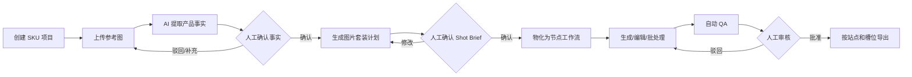
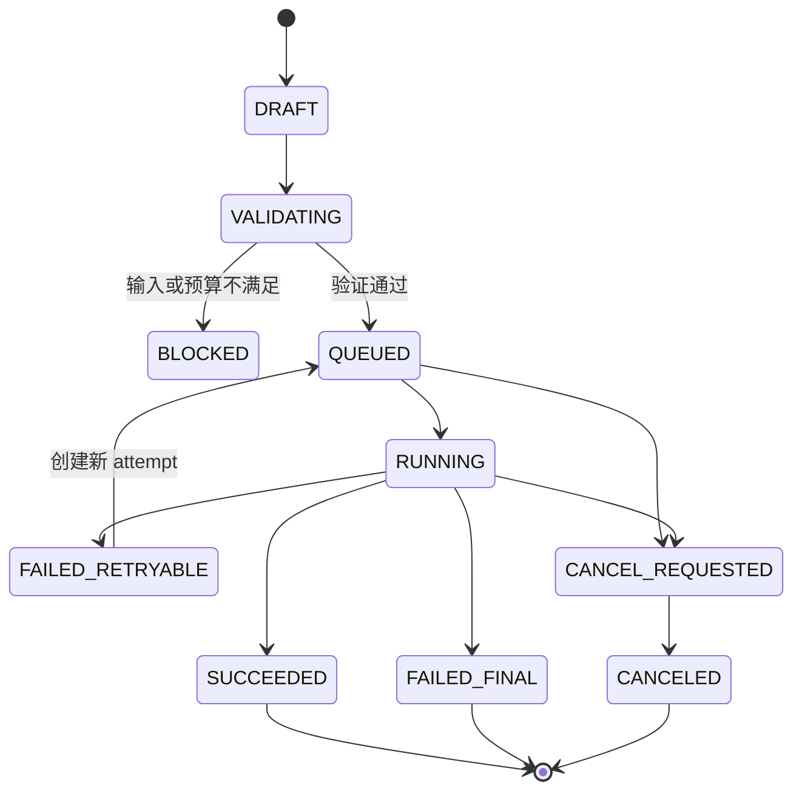
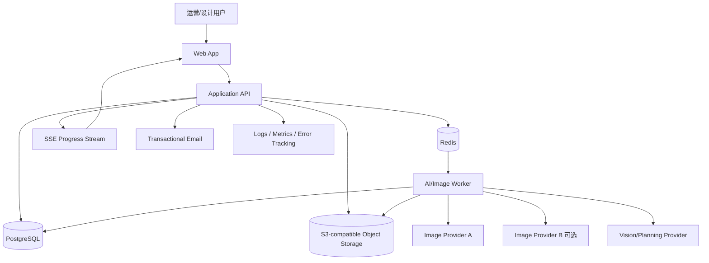
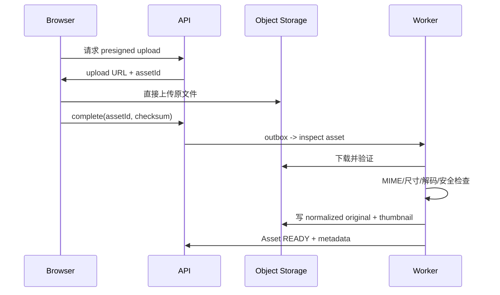
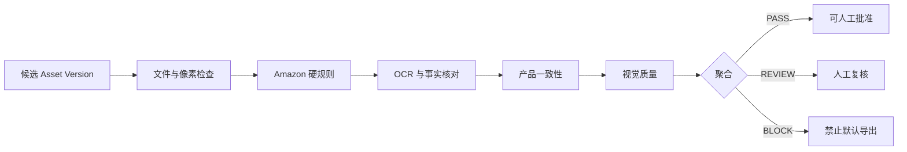

# Amazon AI Image Studio：6–9 周可执行架构与交付规格

> 文档类型：产品范围冻结 + 技术架构 + 实施计划 + 验收标准 + AI 接手协议  
> 版本：v1.1（已完成无上下文 AI Reader Test）  
> 日期：2026-09-11  
> 目标读者：接手开发的 AI 编程代理、技术负责人、全栈工程师、产品负责人  
> 交付目标：在 6–9 周内完成一个能真实支撑 Amazon 商品图片生产的 Web MVP，而不是只可演示的界面原型

---

## 0. 给接手 AI 的第一条指令

如果你是第一次读取本文档的 AI，请严格按以下顺序开始，不要直接生成大量页面代码：

1. 完整阅读本文档。
2. 检查仓库根目录的 `AGENTS.md`、`README.md`、`.env.example`、`docs/decisions/` 和 `docs/progress.md`。
3. 执行只读检查：`git status`、目录树、包管理器和现有测试。
4. 先执行 `W0-01` Baseline Audit：若仓库非空，把现有能力逐项映射到任务账本；只有测试证据充分的任务才能标记 `VERIFIED`，不得覆盖已有 progress。
5. 将本文第 24 节的任务账本同步到 `docs/progress.md`，保留已有状态和任务 ID。绿地项目从 `W1-01` 开始；现有项目从第一个依赖满足且未验证的任务开始。
6. 每个任务都必须提交：实现、测试、运行证据、文档更新。不得只写占位符后标记完成。
7. 遇到产品选择缺失时，使用本文第 3.3 节的默认决策；只有会导致数据丢失、外部付费、上线发布或范围明显变化时才询问用户。
8. 不要复刻参考网站的商标、文案或视觉资产；借鉴其工作流思想，界面和代码必须独立实现。

**完成定义：** 用户可以创建 SKU 项目，上传并确认产品事实，生成一套 Amazon 图片计划，在节点画布中生产和修改图片，批量处理变体，对结果执行可解释 QA，人工批准后导出带清单的 ZIP；失败任务可安全重试，所有结果可追溯到输入、模型、提示词和父版本。

---

## 1. 执行摘要

### 1.1 推荐结论

采用一个桌面优先的 Web SaaS 架构：

- 前端：React / Next.js / TypeScript。
- 画布：`@xyflow/react`，不从零开发无限画布。
- 蒙版编辑：Canvas/Konva 体系，蒙版坐标统一存储为归一化坐标。
- API：REST + OpenAPI + Zod 运行时校验。
- 数据库：PostgreSQL。
- 队列：Redis + BullMQ，独立 Worker 处理长任务。
- 文件：S3 兼容对象存储，所有资产私有，按需签名访问。
- 图像处理：Sharp 承担确定性操作；生成、编辑、视觉理解通过可替换 Provider Adapter。
- 实时进度：SSE，MVP 不使用复杂 WebSocket 协作。
- 测试：Vitest + Playwright + Provider Fake + 固定商品评测集。

### 1.2 工期口径

| 交付线 | 时间 | 能力边界 |
|---|---:|---|
| 内部可用线 | 第 6 周 | 单工作区、核心生图闭环、一个主提供商、Amazon MAIN 基础 QA、ZIP 导出 |
| 推荐上线线 | 第 8 周 | 一个生产 Provider、批量变体、完整失败恢复、评测集、监控、稳定 Staging/Production；第二 Provider 为条件性增强 |
| 风险缓冲线 | 第 9 周 | 供应商适配、视觉一致性调优、性能和安全修复、发布验收 |

默认以 **8 周**作为项目计划。第 6 周是可用而非完成，第 9 周只能用于已知风险收敛，不能新增大型功能。

### 1.3 核心产品原则

1. **产品真实性优先于画面美感。** 不能为了“好看”修改真实结构、配件、Logo、材质或数量。
2. **Amazon MAIN 是独立输出类型。** 它不是普通电商首图模板的一个皮肤。
3. **所有派生结果不可覆盖源文件。** 每次生成、编辑和批准都创建不可变版本。
4. **每次模型调用必须可审计。** 保存提供商、模型 ID、参数、输入资产版本、提示词、成本、耗时和结果。
5. **自动 QA 只做门禁与辅助判断。** 最终发布必须有人工作出明确批准。
6. **批量失败必须局部恢复。** 一张失败不应让整批任务重做或重复计费。
7. **模型是可替换依赖。** 业务代码不得直接依赖某个供应商的请求结构。

---

## 2. 目标与非目标

### 2.1 MVP 必须实现

#### A. 项目与商品事实

- 用户注册、登录、退出和密码重置。
- 创建、复制、归档 SKU 项目。
- 上传产品整体图、细节图、包装图和 Logo/标签特写。
- 自动提取产品事实，用户逐条确认、修改或标记未知。
- 维护不可变化项、允许变化项、包装清单和文字真值。
- 保存市场、站点、类目和目标语言。

#### B. 图片策划

- 创建 Amazon 图片套装计划。
- 最少支持 MAIN、FEATURE、DETAIL、DIMENSION、LIFESTYLE、PACKAGE 六类 Shot Brief 类型；默认 7 图计划不自动实例化 PACKAGE，用户可手动添加。
- AI 可以生成策划草稿，但进入生产前必须人工确认。
- 策划可一键物化为节点画布。

#### C. 节点画布

- 添加、移动、删除、复制节点。
- 类型化端口和连线校验。
- 多选、框选、缩放、适应画布、撤销/重做。
- 自动保存、版本快照、刷新恢复。
- 上游变化时，下游结果标记为 `STALE`，不静默复用旧结果。
- 支持运行单节点、选中分支或整个工作流。

#### D. 核心节点

MVP 固定为以下 11 类：

1. `source_image`：源图片。
2. `product_truth`：商品事实包引用。
3. `prompt`：提示词和负面约束。
4. `remove_background`：抠图和蒙版。
5. `generate`：参考图生图。
6. `replace_background`：锁产品换背景。
7. `inpaint`：局部重绘。
8. `outpaint`：扩图。
9. `upscale`：高清化。
10. `qa_gate`：产品一致性、Amazon 合规、视觉质量检查；只产生 QA 资格结果，不产生人工批准。
11. `export`：服务端再次验证人工 Approval 后，整理资产并生成 ZIP。

#### E. 批量变体

- 基于已批准母版生成颜色或 SKU 变体。
- 支持部件级颜色描述与 HEX 值。
- 默认锁定结构、Logo、文字、构图和附件数量。
- 每个变体独立记录状态、结果、QA 和重试。

#### F. QA 与批准

- Amazon MAIN 硬规则检查。
- 产品一致性检查。
- OCR/文字真值检查。
- 视觉瑕疵检查。
- `PASS / REVIEW / BLOCK` 三态结论和可解释原因。
- 人工批准、驳回、覆盖自动结论；覆盖必须填写原因。

#### G. 导出与审计

- 只默认导出已批准版本。
- ZIP 内包含 PNG/JPEG 图片、`manifest.json`、`qa-report.csv`。
- 文件名可预测并包含 SKU、站点、槽位、变体和版本。
- 可查看资产血缘、任务日志和成本台账。

### 2.2 第一期明确不做

以下项目不允许在 6–9 周排期中临时加入：

- 3D 模型上传、渲染和 360 度视频。
- 完整 Listing 文案工作台。
- 自动抓取 Amazon BSR、自然排名和竞品数据。
- 全功能图片翻译和自动文字回排。
- 法律意义上的 IP 侵权判定。
- 多人实时协作、评论和光标同步。
- DOCX、PPTX、XLSX Artifact 编辑器。
- 移动端原生应用。
- 自建 GPU 推理集群或训练基础模型。
- 公开模型市场和十几个提供商同时接入。
- 复杂订阅计费；MVP 只做内部额度台账和管理员调整。

### 2.3 可作为第 8–9 周候选但默认关闭

只有第 1–7 周验收全部通过并有剩余容量时，才能选择其中一项：

- 第二个图片模型提供商及自动故障切换。
- 术语锁定的单语图片翻译试验版。
- 品牌色板与字体风格套件。
- 分享只读链接。
- 简单的 Stripe/国内支付入口。

不得同时选择两项以上。

---

## 3. 假设、依赖和默认决策

### 3.1 排期成立的前提

- 至少一名产品负责人能在一个工作日内回答关键问题。
- 第 1 周提供至少 10 个真实 SKU 样本，每个 SKU 有 3–8 张真实参考图。
- 第 2 周前提供至少一个可调用的生图/编辑模型账号和预算。
- 第 4 周前确定部署账号、域名、对象存储和邮件服务。
- 产品负责人有权确认 Amazon 业务规则和最终图片质量。
- 所有第三方模型调用都允许用于相应商品素材，并符合供应商条款。

### 3.2 产品负责人必须提供

| 输入 | 截止时间 | 未提供时的影响 |
|---|---:|---|
| 10 个代表性 SKU 及产品事实 | 第 1 周第 2 天 | 无法建立一致性评测集 |
| 允许/禁止修改清单 | 第 1 周第 3 天 | 只能使用保守默认锁定 |
| 首发 Amazon 站点和类目 | 第 1 周第 3 天 | 使用 US + 通用非服饰类目 |
| 模型 Provider API Key | 第 2 周第 1 天 | 只可使用 Fake Provider 开发 |
| 目标图片套装结构 | 第 2 周第 3 天 | 使用默认 7 图模板 |
| 部署与邮件服务账号 | 第 4 周第 1 天 | Staging 上线延后 |
| 上线审批人和回滚联系人 | 第 7 周 | Production 不得开放 |

### 3.3 无人回答时的默认决策

- 首发站点：Amazon US。
- 页面语言：中文操作界面；输出图片文案默认英文。
- 画面尺寸：主图 2000 × 2000 px、sRGB。
- 默认套装：1 张 MAIN、2 张 FEATURE、1 张 DETAIL、1 张 DIMENSION、2 张 LIFESTYLE，共 7 张。
- 模型：一个主图片提供商；第二提供商用适配器接口预留但不阻塞第 6 周。
- 存储：私有 S3 兼容桶。
- 登录：邮箱密码；不做社交登录。
- 权限：一个用户一个默认 Workspace；数据模型保留多租户字段。
- 额度：管理员手动充值的内部 Credit Ledger；不接真实支付。
- 图片导出：PNG 优先，JPEG 可选，ZIP 包含审计清单。
- QA：任何 `BLOCK` 阻止默认导出；人工覆盖必须留原因和操作者。

### 3.4 进度估算不包含

- 第三方模型审核或开户等待时间。
- Amazon 规则法律审查。
- 大规模品牌设计或营销站制作。
- 生产图片本身的模型调用费用。
- 大量历史数据迁移。

---

## 4. 用户流程与业务状态

### 4.1 主流程



### 4.2 项目状态

```text
DRAFT
  -> FACTS_PENDING
  -> FACTS_APPROVED
  -> PLAN_PENDING
  -> PLAN_APPROVED
  -> PRODUCING
  -> REVIEWING
  -> EXPORT_READY
  -> ARCHIVED
```

约束：

- 事实未批准时不得运行正式生产工作流。
- Shot Plan 未批准时不得批量派发付费任务。
- 任一批准事实变化后，关联工作流输出标记为 `STALE`，需重新 QA。
- `ARCHIVED` 项目只读，可恢复，不立即删除对象存储文件。

### 4.3 任务状态机



规则：

- 重试创建新的 `attempt`，不得覆盖历史 attempt。
- 同一个幂等键只能产生一次计费成功结果。
- 用户取消后若 Provider 无法真正取消，迟到结果可以入库但不得自动设为当前版本。
- Worker 崩溃恢复时必须使用租约/心跳避免双重执行。
- Provider 回调和轮询可以同时存在，但完成状态必须通过原子比较更新。

### 4.4 资产状态

```text
UPLOADING -> PROCESSING -> READY
                     \-> FAILED
READY -> SOFT_DELETED -> PURGED
```

任何派生资产都必须通过 `asset_version_inputs` 保存全部父输入，并引用创建它的 `generation_attempt_id` 或 `image_operation_id`；单一 `primary_parent_version_id` 只用于 UI 展示主分支，不能代替完整血缘。

---

## 5. 系统上下文与组件架构

### 5.1 系统上下文



### 5.2 运行组件

| 组件 | 责任 | 禁止承担 |
|---|---|---|
| `web` | 页面、画布、蒙版 UI、API 路由、鉴权、SSE | 长时间图像处理、直接保存 Provider Secret 到浏览器 |
| `worker` | 队列消费、Provider 调用、轮询、图像处理、QA、导出 | 用户会话、页面渲染 |
| `postgres` | 业务事实、版本、状态、审计、额度台账 | 大图二进制存储 |
| `redis` | 队列、短期锁、限流、SSE 事件中转 | 权威业务状态 |
| `object-storage` | 原图、派生图、蒙版、缩略图、ZIP | 公共永久 URL |
| `provider-adapters` | 供应商协议适配与结果规范化 | 业务 UI 和项目状态逻辑 |

### 5.3 推荐仓库结构

```text
.
├─ AGENTS.md
├─ README.md
├─ .env.example
├─ compose.yaml
├─ package.json
├─ pnpm-workspace.yaml
├─ apps/
│  ├─ web/
│  │  ├─ app/
│  │  ├─ components/
│  │  ├─ features/
│  │  │  ├─ projects/
│  │  │  ├─ product-truth/
│  │  │  ├─ shot-planning/
│  │  │  ├─ studio/
│  │  │  ├─ masking/
│  │  │  ├─ qa/
│  │  │  └─ exports/
│  │  └─ tests/
│  └─ worker/
│     ├─ src/jobs/
│     ├─ src/providers/
│     ├─ src/image/
│     ├─ src/qa/
│     └─ tests/
├─ packages/
│  ├─ contracts/        # Zod schemas + OpenAPI types
│  ├─ db/               # schema, migrations, repositories
│  ├─ domain/           # framework-independent business rules
│  ├─ model-registry/   # provider/model capability catalog
│  ├─ storage/          # S3 adapter, checksums, signed URLs
│  ├─ observability/    # logger, tracing, metrics
│  ├─ testkit/          # factories, fake providers, fixtures
│  └─ ui/               # shared visual primitives
├─ docs/
│  ├─ architecture.md
│  ├─ progress.md
│  ├─ api/openapi.yaml
│  ├─ decisions/
│  ├─ runbooks/
│  └─ qa-rules/
├─ fixtures/
│  └─ eval-products/
└─ scripts/
   ├─ bootstrap.*
   ├─ smoke-test.*
   └─ seed-demo.*
```

### 5.4 依赖方向

```text
UI -> contracts -> application services -> domain -> repositories/adapters
worker jobs -> application services -> domain -> provider/storage adapters
```

强制约束：

- `domain` 不导入 Next.js、BullMQ、数据库客户端或任何 Provider SDK。
- Provider SDK 只能出现在 `apps/worker/src/providers` 或对应 adapter 包。
- 数据库访问只能经过 repository，不允许 UI 路由内散落原始 SQL。
- Zod schema 是 API 入参和任务 payload 的唯一运行时真相。

---

## 6. 技术选型与理由

| 能力 | 选择 | 理由 |
|---|---|---|
| 包管理/Monorepo | pnpm workspace；需要时再加 Turborepo | 快速、锁文件明确、共享包简单 |
| Web | Next.js + React + TypeScript strict | 页面、API 和鉴权集成快 |
| 样式 | Tailwind CSS + 自有 UI tokens | 高迭代效率，避免复制参考站视觉 |
| 状态 | TanStack Query + Zustand | 服务端状态与画布本地状态分离 |
| 画布 | `@xyflow/react` | 节点、端口、缩放、选择和视口能力成熟 |
| 蒙版 | Konva/Canvas；蒙版保存为 PNG | 可控的笔刷、缩放和坐标映射 |
| API | REST + OpenAPI + Zod | 对人和 AI 都直观，便于契约测试 |
| 数据库 | PostgreSQL + Prisma | 关系数据、JSONB、事务、迁移和 AI 接手一致性 |
| 鉴权 | Auth.js Credentials + 数据库 Session + Argon2id | 邮箱密码、本地可测、会话可撤销；密码重置由应用表实现 |
| 队列 | BullMQ + Redis | Node 生态内适合重试、延时和并发 |
| 图像处理 | Sharp | 格式验证、缩略图、合成、颜色空间、基础 QA |
| 对象存储 | S3 兼容 | 可替换 AWS S3、R2、MinIO |
| 进度推送 | Server-Sent Events | 单向任务进度足够，复杂度低于 WebSocket |
| 测试 | Vitest + Playwright | 单元、集成和真实浏览器闭环 |
| 日志 | Pino JSON + request/job correlation ID | 可定位跨 API/Worker 故障 |

版本策略：创建项目时选择当日稳定版本，立即提交 lockfile；之后除安全修复外不在 MVP 中途升级主要版本。不要在本文档里追逐“最新”版本号。

### 6.1 本地开发标准命令

最终仓库必须提供并保证以下命令有效：

```bash
corepack enable
pnpm install
docker compose up -d postgres redis minio
pnpm db:migrate
pnpm db:seed
pnpm dev
pnpm worker
pnpm lint
pnpm typecheck
pnpm test
pnpm test:e2e
pnpm test:eval
pnpm build
```

Windows 下可以增加 PowerShell 包装脚本，但不能移除跨平台的 package scripts。

---

## 7. 领域模型和数据库

### 7.1 必须遵守的数据不变量

1. 每个业务表都必须带 `workspace_id`，查询必须显式限定租户。
2. 源资产和 Asset Version 永不原地覆盖。
3. 一个 QA Report 只对应一个不可变 Asset Version。
4. 一个批准记录必须包含操作者、时间、结论和被批准版本。
5. 每次付费调用在 Credit Ledger 中有唯一外部或内部幂等键。
6. Workflow 的可编辑草稿和不可变 Revision 分离。
7. 已进入运行态的 Workflow Revision 不可修改；修改画布生成新 revision。
8. Model Registry 中的能力快照随 Generation Attempt 保存，避免模型配置变化后无法复现。
9. 导出包必须保存生成时的资产清单，不可动态指向“最新版本”。
10. 所有删除先软删除；对象清理必须通过后台任务，并保留审计事件。

### 7.2 核心表

| 表 | 关键字段 | 关键约束/索引 |
|---|---|---|
| `users` | id, email, password_hash, status | email unique |
| `workspaces` | id, name, owner_user_id | owner index |
| `workspace_members` | workspace_id, user_id, role | pair unique |
| `projects` | id, workspace_id, sku, asin, marketplace, category, status | `(workspace_id, sku)` index |
| `upload_sessions` | id, workspace_id, project_id, expected_key/mime/bytes/checksum, status, expires_at | completion key unique |
| `product_truth_documents` | id, workspace_id, project_id, current_revision_id, approved_revision_id | project unique |
| `product_truth_revisions` | id, workspace_id, document_id, revision, status, approved_by | document/revision unique |
| `product_facts` | workspace_id, truth_revision_id, key, value_json, confidence, evidence_asset_version_ids | revision/key index |
| `product_constraints` | workspace_id, truth_revision_id, kind, path, rule, severity | kind: LOCK/ALLOW/UNKNOWN |
| `assets` | id, workspace_id, project_id, kind, status, current_version_id | project/status index |
| `asset_versions` | id, workspace_id, asset_id, primary_parent_version_id, sha256, mime, width, height, metadata_json | sha256 index；内容字段不可更新；文件表示另表保存 |
| `asset_representations` | id, workspace_id, asset_version_id, kind, storage_key, sha256, bytes | version/kind index |
| `asset_version_inputs` | workspace_id, asset_version_id, input_type, input_id, role, order_index | 完整多父血缘 |
| `masks` | id, workspace_id, asset_version_id, strokes_json, coordinate_space, metadata_json | PNG 表示另存 representation |
| `image_operations` | id, workspace_id, operation, request_snapshot, status | 确定性操作审计 |
| `shot_plan_documents` | id, workspace_id, project_id, current_revision_id, approved_revision_id | project index |
| `shot_plan_revisions` | id, workspace_id, document_id, revision, status, truth_revision_id | document/revision unique |
| `shot_briefs` | id, workspace_id, shot_plan_revision_id, slot, purpose, copy_json, constraints_json, order_index | revision/order unique |
| `workflows` | id, workspace_id, project_id, name, current_revision_id | project index |
| `workflow_drafts` | id, workspace_id, workflow_id, graph_json, revision_number, updated_by | workflow unique |
| `workflow_revisions` | id, workspace_id, workflow_id, revision, graph_json, created_by | workflow/revision unique |
| `generation_runs` | id, workspace_id, workflow_revision_id, scope_json, status, requested_by, budget_limit | status index |
| `generation_items` | id, workspace_id, run_id, node_id, slot, variant_id, output_index, item_key, status | item_key unique |
| `generation_attempts` | id, workspace_id, item_id, attempt_no, idempotency_key, provider, model_id, request_snapshot, status | item/attempt unique |
| `provider_submissions` | id, workspace_id, attempt_id, external_job_id, submission_key, lease_token, heartbeat_at, status | provider/external job unique |
| `generation_outputs` | id, workspace_id, attempt_id, output_index, asset_version_id, disposition | attempt/output unique |
| `job_outbox` | id, workspace_id, event_type, payload_json, status, available_at | status/available_at index |
| `provider_events` | workspace_id, provider, external_event_id, payload_hash, processed_at | triple unique |
| `variants` | id, workspace_id, project_id, code, master_variant_id, status | project/code unique |
| `variant_components` | id, workspace_id, variant_id, component_key, color/material/locks | variant/component unique |
| `variant_items` | id, workspace_id, variant_id, shot_brief_id, generation_item_id, status | variant/brief index |
| `qa_reports` | id, workspace_id, asset_version_id, rule_pack_version, overall_status, model_snapshot | asset/rule pack index |
| `qa_findings` | id, workspace_id, report_id, rule_id, status, score, message, evidence_json | report/status index |
| `approvals` | id, workspace_id, asset_version_id, qa_report_id, truth_revision_id, brief_revision_id, decision, reason, user_id | append-only；asset index |
| `export_bundles` | id, workspace_id, project_id, status, manifest_json, storage_key | project/status index |
| `credit_accounts/events` | workspace_id, available/held/consumed；event type, microunits, attempt_id, idempotency | append-only event + 原子快照 |
| `provider_cost_events` | workspace_id, provider_submission_id, type, amount_numeric, currency, settlement_key, provider_invoice_line_id | 用户 Credit 与 COGS 分离；settlement key unique |
| `audit_events` | id, workspace_id, actor_id, action, subject_type, subject_id, metadata_json | workspace/created_at index |

### 7.3 Product Truth Pack 示例

```json
{
  "schemaVersion": 1,
  "projectId": "prj_123",
  "sku": "MUG-BLK-450",
  "marketplace": "US",
  "category": "Kitchen > Drinkware",
  "facts": {
    "brand": {"value": "Acme", "status": "confirmed"},
    "productType": {"value": "insulated travel mug", "status": "confirmed"},
    "capacity": {"value": 450, "unit": "ml", "status": "confirmed"},
    "materials": [{"value": "304 stainless steel", "status": "confirmed"}],
    "includedItems": ["mug", "lid"],
    "printedText": ["ACME", "450ML"]
  },
  "locks": [
    "body silhouette",
    "lid geometry",
    "logo spelling and placement",
    "number of included items",
    "handle absence"
  ],
  "allowedChanges": ["background", "surface", "ambient lighting"],
  "referenceAssetVersionIds": ["av_front", "av_side", "av_logo"],
  "status": "APPROVED",
  "approvedBy": "usr_123",
  "approvedAt": "2026-09-11T08:00:00Z"
}
```

### 7.4 Shot Brief 示例

```json
{
  "schemaVersion": 1,
  "slot": "MAIN",
  "purpose": "Amazon search results main image",
  "aspectRatio": "1:1",
  "targetPixels": {"width": 2000, "height": 2000},
  "copy": [],
  "must": [
    "pure white background",
    "show only included items",
    "preserve exact product geometry and printed text",
    "product fully inside frame"
  ],
  "mustNot": [
    "overlay text",
    "watermark",
    "border",
    "decorative prop",
    "badge",
    "unincluded accessory"
  ],
  "qaPolicy": "amazon-main-us-v1",
  "status": "APPROVED"
}
```

### 7.5 Workflow Graph 示例

```json
{
  "schemaVersion": 1,
  "nodes": [
    {"id": "n1", "type": "source_image", "position": {"x": 0, "y": 0}, "config": {"assetVersionId": "av_front"}},
    {"id": "n2", "type": "product_truth", "position": {"x": 0, "y": 220}, "config": {"truthPackRevision": 2}},
    {"id": "n3", "type": "prompt", "position": {"x": 280, "y": 0}, "config": {"shotBriefId": "sb_main"}},
    {"id": "n4", "type": "generate", "position": {"x": 560, "y": 0}, "config": {"modelKey": "primary-image-edit", "count": 2}},
    {"id": "n5", "type": "qa_gate", "position": {"x": 840, "y": 0}, "config": {"policyKey": "amazon-main-us-v1"}},
    {"id": "n6", "type": "approval_selector", "position": {"x": 1120, "y": 0}, "config": {"requiredRole": "REVIEWER"}},
    {"id": "n7", "type": "export", "position": {"x": 1400, "y": 0}, "config": {"format": "png"}}
  ],
  "edges": [
    {"id": "e1", "source": "n1", "sourceHandle": "image", "target": "n4", "targetHandle": "references"},
    {"id": "e2", "source": "n2", "sourceHandle": "truth", "target": "n4", "targetHandle": "truth"},
    {"id": "e3", "source": "n3", "sourceHandle": "prompt", "target": "n4", "targetHandle": "prompt"},
    {"id": "e4", "source": "n4", "sourceHandle": "images", "target": "n5", "targetHandle": "images"},
    {"id": "e5", "source": "n5", "sourceHandle": "candidates", "target": "n6", "targetHandle": "candidates"},
    {"id": "e6", "source": "n6", "sourceHandle": "approvedAssets", "target": "n7", "targetHandle": "assets"}
  ]
}
```

---

## 8. 节点执行契约

### 8.1 通用节点接口

```ts
type NodeExecutionStatus =
  | "IDLE"
  | "STALE"
  | "BLOCKED"
  | "QUEUED"
  | "RUNNING"
  | "SUCCEEDED"
  | "FAILED"
  | "CANCELED";

interface NodeDefinition<TConfig> {
  type: string;
  version: number;
  inputPorts: PortDefinition[];
  outputPorts: PortDefinition[];
  configSchema: unknown;
  estimateCost(config: TConfig, inputs: ResolvedInput[]): Promise<CostEstimate>;
  validate(config: TConfig, inputs: ResolvedInput[]): ValidationIssue[];
  execute(ctx: JobContext, config: TConfig, inputs: ResolvedInput[]): Promise<NodeOutput>;
}
```

每次执行前：

1. 解析 Workflow Revision。
2. 对目标节点做拓扑排序并检测环。
3. 校验端口类型、必填输入、事实包状态和预算。
4. 计算输入指纹：节点配置 + 上游不可变版本 ID + 模型能力快照。
5. 若存在成功且未过期的相同指纹，可提示复用，但付费重跑必须由用户明确选择。
6. 为每个可执行节点创建 Attempt 和 Outbox Event。
7. Worker 完成后创建新 Asset Version，并发布进度事件。

### 8.2 端口类型

```text
IMAGE
IMAGE_LIST
MASK
PROMPT
PRODUCT_TRUTH
SHOT_BRIEF
QA_REPORT
QA_CANDIDATE_LIST
APPROVED_ASSET_LIST
```

端口规则：

- 单值端口不接受多个入边。
- `IMAGE_LIST` 可以接 `IMAGE` 或 `IMAGE_LIST`，执行前扁平化并保留顺序。
- `QA_CANDIDATE_LIST` 只能来自 `qa_gate`；它包含 PASS、REVIEW、BLOCK 全部候选及其 QA Report，便于授权角色人工批准或覆盖，不代表任何候选已批准。
- `APPROVED_ASSET_LIST` 只能来自系统 `approval_selector`，并且每个 Asset Version 都存在当前有效的人工 Approval。
- `export` 禁止直接接收未经 QA/批准的普通 `IMAGE_LIST`。

### 8.3 MVP 节点定义

| 节点 | 输入 | 输出 | 核心配置 | 执行位置 |
|---|---|---|---|---|
| `source_image` | 无 | IMAGE | assetVersionId | Web/DB |
| `product_truth` | 无 | PRODUCT_TRUTH | truthPackRevision | DB |
| `prompt` | SHOT_BRIEF 可选 | PROMPT | text, negative, locale | Web/DB |
| `remove_background` | IMAGE | IMAGE, MASK | subjectHint, edgeMode | Worker |
| `generate` | IMAGE_LIST, PROMPT, PRODUCT_TRUTH | IMAGE_LIST | modelKey, ratio, resolution, count, seed | Worker/Provider |
| `replace_background` | IMAGE, MASK, PROMPT, PRODUCT_TRUTH | IMAGE_LIST | fidelity, lightBlend | Worker/Provider |
| `inpaint` | IMAGE, MASK, PROMPT, IMAGE_LIST 可选 | IMAGE_LIST | strength, modelKey | Worker/Provider |
| `outpaint` | IMAGE, PROMPT 可选 | IMAGE_LIST | targetRatio, placement, modelKey | Worker/Provider |
| `upscale` | IMAGE | IMAGE | engineKey, targetResolution | Worker/Provider |
| `qa_gate` | IMAGE_LIST, PRODUCT_TRUTH, SHOT_BRIEF | QA_REPORT, QA_CANDIDATE_LIST | policyKey | Worker |
| `approval_selector`（系统节点，不在节点库手动创建） | QA_CANDIDATE_LIST + 有效人工 Approval | APPROVED_ASSET_LIST | requiredRole | API/DB |
| `export` | APPROVED_ASSET_LIST | 导出包记录 | namingPreset, format | Worker |

### 8.4 画布保存和冲突策略

- 客户端本地每 500 ms debounce 保存草稿。
- API 使用 `revision_number` 乐观并发；更新时必须传 `ifRevision`。
- 冲突返回 `409 WORKFLOW_REVISION_CONFLICT`，前端提供重新加载和另存为副本。
- 每次正式运行前创建不可变 Workflow Revision。
- 草稿 JSON 每个节点配置都包含 schema version，以支持迁移。
- 撤销/重做只作用于当前浏览器会话；服务端版本历史用于跨会话恢复。

---

## 9. Provider 与模型网关

### 9.1 Provider Adapter 接口

```ts
interface ImageProviderAdapter {
  readonly providerKey: string;
  getCapabilities(modelId: string): Promise<ModelCapabilities>;
  submit(request: NormalizedImageRequest): Promise<ProviderSubmission>;
  recoverSubmission?(submissionKey: string): Promise<ProviderSubmission | "NOT_FOUND" | "UNKNOWN">;
  getStatus(externalJobId: string): Promise<ProviderJobStatus>;
  cancel?(externalJobId: string): Promise<CancelResult>;
  verifyWebhook?(headers: Headers, rawBody: Uint8Array): Promise<VerifiedProviderEvent>;
  normalizeError(error: unknown): NormalizedProviderError;
  estimateCost(request: NormalizedImageRequest): Promise<MoneyEstimate>;
}
```

`recoverSubmission` 是 `QUERYABLE_CLIENT_REFERENCE` Adapter 的必选实现，用于提交请求已发出但客户端未收到 `externalJobId` 的情况。`NATIVE_IDEMPOTENCY` Adapter 可以用相同 submission key 安全重放 `submit`；`UNSAFE` Adapter 不提供恢复保证，不能作为 Production 默认 Provider。

`NormalizedImageRequest` 至少包含：

- operation：`GENERATE | EDIT | INPAINT | OUTPAINT | UPSCALE | REMOVE_BACKGROUND | VISION_ANALYZE`。
- prompt / negativePrompt。
- referenceAssets：短期签名 URL 或上传后的 Provider File ID。
- maskAsset。
- width / height / aspectRatio / resolutionTier。
- count、seed、strength。
- callback URL 和内部幂等键。
- product truth constraints 的机器可读摘要。

### 9.2 Model Registry

模型不能散落在前端下拉菜单中硬编码。Registry 记录：

```json
{
  "key": "primary-image-edit",
  "provider": "provider-a",
  "modelId": "exact-provider-model-id",
  "displayName": "Primary Product Image Edit",
  "enabled": true,
  "operations": ["EDIT", "INPAINT", "OUTPAINT"],
  "ratios": ["1:1", "4:5", "3:4", "16:9"],
  "resolutionTiers": ["1K", "2K", "4K"],
  "maxReferenceImages": 8,
  "maxOutputs": 4,
  "supportsSeed": false,
  "supportsWebhook": true,
  "pricing": {"currency": "USD", "unit": "image", "estimatedUnitCost": 0},
  "configVersion": 1
}
```

模型注册表必须由服务端返回；UI 只展示兼容当前节点 operation 的启用模型。

### 9.3 错误分类

| 类别 | 是否自动重试 | 示例 |
|---|---|---|
| `AUTH` | 否 | Key 无效、账号停用 |
| `VALIDATION` | 否 | 比例不支持、参考图过多 |
| `POLICY` | 否 | Provider 内容策略拒绝 |
| `RATE_LIMIT` | 是 | 429 |
| `TRANSIENT` | 是 | 5xx、网关断开 |
| `TIMEOUT` | 是，最多两次 | 长时间无结果 |
| `QUOTA` | 否并通知管理员 | Provider 余额不足 |
| `UNKNOWN` | 一次 | 未分类异常 |

自动重试使用指数退避和抖动。`AUTH`、`VALIDATION`、`POLICY`、`QUOTA` 不能盲目重试。

### 9.4 调用与计费顺序

1. API 根据模型注册表给出成本估算。
2. 用户确认超出项目阈值的批量运行。
3. 数据库事务中创建 Run、Attempt、额度预留和 Outbox Event。
4. Dispatcher 将 Outbox Event 投递到 BullMQ。
5. Worker 获取短租约并调用 Provider。
6. 成功后记录实际成本，释放差额或追加实际消耗。
7. 失败时按错误类型退还预留或保留已发生费用。
8. Ledger 总余额只通过记录求和或受控快照计算，不直接修改一个无审计的数字。

---

## 10. 文件与图像管线

### 10.1 上传流程



### 10.2 上传安全限制

- 默认只允许 PNG、JPEG、WebP；蒙版只允许 PNG。
- 单图不超过 20 MB，单次最多 30 张。
- 使用文件魔数验证 MIME，不能相信扩展名。
- 解码后检查像素总量，防止 decompression bomb。
- 移除 EXIF 中可能包含的定位和设备信息。
- 标准化到 sRGB；保留原始文件但生成统一工作版本。
- 不允许 API 根据任意用户 URL 服务端抓图，防止 SSRF。
- 对象 key 由服务端生成，不直接使用用户文件名。

### 10.3 对象存储 key

```text
workspaces/{workspaceId}/projects/{projectId}/assets/{assetId}/
  original/{versionId}.{ext}
  normalized/{versionId}.png
  thumbnails/{versionId}-512.webp
  masks/{maskId}.png
  qa/{reportId}.json
  exports/{bundleId}.zip
```

所有 bucket 私有；前端只获得 5–15 分钟有效的签名 URL。

### 10.4 蒙版坐标规范

- UI 笔刷点以 `[0,1] × [0,1]` 归一化坐标保存。
- 服务端执行前渲染为与源 Asset Version 完全一致的全分辨率灰度 PNG。
- 白色表示编辑区域，黑色表示锁定区域；禁止每个 Provider 使用不同内部语义。
- 保存 `sourceWidth`、`sourceHeight`、编辑器 viewport 版本和羽化值。
- 旋转或裁剪后必须生成新 Asset Version 和对应的新蒙版，禁止复用旧坐标。

### 10.5 文件输出命名

```text
{SKU}_{MARKETPLACE}_{SLOT}_{VARIANT}_{INDEX}_v{VERSION}.{ext}
```

示例：

```text
MUG-BLK-450_US_MAIN_BLACK_01_v3.png
MUG-BLK-450_US_LIFESTYLE_BLACK_06_v2.png
```

---

## 11. Amazon 图片计划与 QA 架构

### 11.1 默认 7 图模板

| 序号 | Slot | 目标 | 默认约束 |
|---:|---|---|---|
| 1 | MAIN | 搜索结果主图 | 纯白、无叠加文字、仅售卖物、完整构图 |
| 2 | FEATURE | 第一核心卖点 | 一项主卖点，文字来自已确认事实 |
| 3 | FEATURE | 第二核心卖点 | 材质/结构，禁止创造规格 |
| 4 | DETAIL | 细节特写 | 放大真实接口或材质，保持几何真实 |
| 5 | DIMENSION | 尺寸/容量 | 只使用已确认数值和单位 |
| 6 | LIFESTYLE | 使用场景 | 产品真实、人物和环境不喧宾夺主 |
| 7 | LIFESTYLE | 目标人群/情境 | 不作无法证明的性能承诺 |

### 11.2 QA 分层



### 11.3 规则类型

#### 确定性规则

- 可解码、格式、颜色空间、宽高和文件大小。
- MAIN 图背景边缘/连通区域白度。
- 主体边界框占比。
- Alpha、边框和异常留白。
- OCR 是否出现叠加文案。
- 已确认数值、品牌、型号是否拼写一致。
- 重复图片、空白图片和严重模糊。

#### 视觉模型规则

- 产品结构、Logo 位置、接口、按钮和配件数量是否变化。
- 是否出现未售配件或不可信场景。
- 透视、接地阴影、反射、手部和材质是否异常。
- 场景是否压过产品主体。

视觉模型必须返回符合 schema 的 JSON，不接受自然语言作为最终数据库状态。

### 11.4 QA Finding Schema

```json
{
  "ruleId": "PRODUCT.LOGO_TEXT_MATCH",
  "ruleVersion": 1,
  "status": "REVIEW",
  "severity": "HIGH",
  "nonWaivable": false,
  "score": 0.73,
  "message": "候选图中的品牌文字可能由 ACME 变为 ACOME",
  "evidence": {
    "referenceAssetVersionIds": ["av_logo"],
    "candidateAssetVersionId": "av_candidate",
    "regions": [{"x": 0.31, "y": 0.42, "width": 0.18, "height": 0.08}],
    "ocrExpected": "ACME",
    "ocrObserved": "ACOME"
  },
  "suggestedAction": "局部重绘 Logo 区域或选择原始产品图合成"
}
```

### 11.5 聚合逻辑

- 任一 `CRITICAL + FAIL` => `BLOCK`。
- 任一 Amazon MAIN 硬规则失败 => `BLOCK`。
- `HIGH + REVIEW` 或两个以上 `MEDIUM + REVIEW` => `REVIEW`。
- 其余规则通过 => `PASS`。
- 人工覆盖不改变原始 QA Report，只新增 Approval/Override 记录。
- 规则阈值由 `MarketRulePack` 版本控制，不散落在代码里。

### 11.6 合规边界

系统文案必须写明：自动 QA 是发布前辅助检查，不构成 Amazon 接受保证、法律意见或知识产权结论。类目规则可能覆盖通用规则，运营人员需做最终确认。

---

## 12. API 设计

所有端点以 `/api/v1` 开头；错误格式统一：

```json
{
  "error": {
    "code": "WORKFLOW_REVISION_CONFLICT",
    "message": "Workflow draft changed since it was loaded.",
    "requestId": "req_123",
    "details": {"expected": 7, "actual": 8}
  }
}
```

### 12.1 项目和商品事实

| Method | Path | 用途 |
|---|---|---|
| POST | `/projects` | 创建 SKU 项目 |
| GET | `/projects` | 搜索/分页项目 |
| GET | `/projects/{projectId}` | 项目详情 |
| PATCH | `/projects/{projectId}` | 更新基础字段 |
| POST | `/projects/{projectId}/archive` | 归档 |
| POST | `/projects/{projectId}/duplicate` | 复制项目但不复制任务 |
| GET | `/projects/{projectId}/truth-pack` | 获取当前事实包 |
| PUT | `/projects/{projectId}/truth-pack` | 保存新事实包 revision |
| POST | `/projects/{projectId}/truth-pack/extract` | 派发 AI 提取任务 |
| POST | `/projects/{projectId}/truth-pack/approve` | 人工批准指定 revision |

### 12.2 上传和资产

| Method | Path | 用途 |
|---|---|---|
| POST | `/uploads/presign` | 创建上传会话 |
| POST | `/uploads/{uploadId}/complete` | 校验 checksum 并开始处理 |
| GET | `/assets/{assetId}` | 元数据和版本列表 |
| GET | `/asset-versions/{versionId}/download-url` | 短期签名 URL |
| POST | `/asset-versions/{versionId}/set-current` | 选择当前版本 |
| DELETE | `/assets/{assetId}` | 软删除 |

### 12.3 Shot Plan 和工作流

| Method | Path | 用途 |
|---|---|---|
| POST | `/projects/{projectId}/shot-plans/generate` | 创建策划草稿 |
| GET | `/shot-plans/{planId}` | 获取计划和 Brief |
| PUT | `/shot-plans/{planId}` | 保存新 revision |
| POST | `/shot-plans/{planId}/approve` | 批准计划 |
| POST | `/shot-plans/{planId}/materialize` | 生成工作流画布 |
| GET | `/workflows/{workflowId}` | 获取当前草稿 |
| PATCH | `/workflows/{workflowId}` | 带 `ifRevision` 保存 |
| POST | `/workflows/{workflowId}/snapshot` | 创建不可变 revision |
| POST | `/workflow-revisions/{revisionId}/validate` | 静态验证和成本估算 |

### 12.4 运行、进度和重试

| Method | Path | 用途 |
|---|---|---|
| POST | `/workflow-revisions/{revisionId}/runs` | 运行全图或指定节点 |
| GET | `/runs/{runId}` | 运行状态和节点状态 |
| POST | `/runs/{runId}/cancel` | 请求取消未完成任务 |
| POST | `/attempts/{attemptId}/retry` | 创建新 attempt |
| GET | `/events?projectId=...` | SSE 进度流 |
| GET | `/model-registry` | 返回可用能力和成本估算 |

运行请求示例：

```json
{
  "scope": {"type": "BRANCH_FROM", "nodeId": "n4"},
  "reuseSucceededInputs": true,
  "budgetLimit": {"currency": "USD", "amount": 2.50},
  "idempotencyKey": "client-generated-uuid"
}
```

### 12.5 QA、批准和导出

| Method | Path | 用途 |
|---|---|---|
| POST | `/asset-versions/{versionId}/qa` | 派发指定规则包 QA |
| GET | `/qa-reports/{reportId}` | 获取 Finding 和证据区域 |
| POST | `/asset-versions/{versionId}/approvals` | 批准、驳回或覆盖 |
| POST | `/projects/{projectId}/exports` | 创建固定清单导出 |
| GET | `/exports/{bundleId}` | 导出状态 |
| GET | `/exports/{bundleId}/download-url` | ZIP 短期 URL |

### 12.6 Provider Webhook

```text
POST /api/v1/providers/{providerKey}/webhook
```

要求：

- 使用原始 body 验证签名。
- Provider Event ID 唯一；重复回调返回 2xx 但不得重复处理。
- 未知外部任务记录安全告警，不猜测匹配。
- 回调只更新外部状态并投递后处理，不在 HTTP 请求中下载大文件。

---

## 13. 前端信息架构

### 13.1 路由

```text
/login
/forgot-password
/projects
/projects/new
/projects/:projectId/overview
/projects/:projectId/truth
/projects/:projectId/plan
/projects/:projectId/studio
/projects/:projectId/review
/projects/:projectId/export
/settings/models
/settings/usage
/admin/jobs
```

### 13.2 页面责任

| 页面 | 核心内容 | 完成条件 |
|---|---|---|
| Projects | 搜索、状态、缩略图、创建/复制/归档 | 可恢复最近项目 |
| Truth | 上传、AI 提取、事实证据、锁定项、批准 | 未批准时明确阻止生产 |
| Plan | 图片槽位、目标、文案、约束、批准 | 可一键物化画布 |
| Studio | 节点库、画布、属性面板、任务抽屉、历史 | 刷新不丢状态，错误可重试 |
| Review | 候选对比、QA Finding、证据框、批准/驳回 | 每个槽位明确责任人和结论 |
| Export | 站点、槽位、文件名、格式、清单 | 只默认选择已批准版本 |
| Usage | 额度、调用、成本、失败退款 | 可追溯到 attempt |
| Admin Jobs | 卡住任务、Provider 健康、重派发 | 权限受限，有审计 |

### 13.3 Studio 布局

```text
┌──────────────┬────────────────────────────────┬──────────────────┐
│ 节点/素材库   │                                │ 节点属性/QA       │
│ 模板          │          可缩放画布             │ 模型/参数/成本     │
│ 项目资产      │                                │ 输入验证           │
├──────────────┴────────────────────────────────┴──────────────────┤
│ 任务抽屉：排队 / 运行 / 成功 / 失败 / 重试 / 预计与实际成本       │
└─────────────────────────────────────────────────────────────────┘
```

### 13.4 交互规则

- 运行前显示将执行的节点数、预计图片数和成本上限。
- 删除有下游依赖的节点时显示影响范围。
- 上游修改后，下游显示明显 `STALE` 标签。
- `BLOCK` 结果在画布和 Review 页都显示红色门禁，不得只藏在任务日志。
- 所有错误包含可执行建议：修改输入、换模型、重试、联系管理员。
- 键盘快捷键至少支持删除、复制、粘贴、撤销、重做、适应画布。
- 首发为桌面优先，最低有效宽度 1280 px；窄屏显示“不支持完整画布编辑”而不是破损布局。

---

## 14. 安全、权限和隐私

### 14.1 授权

- 所有 API 从服务端会话解析 `user_id` 和 `workspace_id`，不信任客户端传入的租户 ID。
- Repository 方法必须强制接受 `workspaceId`。
- 管理员接口使用单独角色和审计事件。
- 下载 URL 生成前再次验证资产归属。
- 后续使用数据库 RLS 时，RLS 是第二道防线，不替代应用层校验。

### 14.2 Secret

- Provider Key、数据库、Redis 和 S3 Secret 只能存在于服务端 Secret Manager/环境变量。
- `.env` 永不提交；仓库只提交 `.env.example`。
- 日志对 Authorization、Cookie、签名 URL query 和 Provider 原始响应做脱敏。
- Provider Key 轮换不应要求重新部署前端。

### 14.3 数据生命周期

- 用户删除项目：立即隐藏，进入 30 天软删除期。
- 30 天后 Worker 清理对象及数据库可识别内容；保留最小审计记录。
- 导出签名 URL 15 分钟过期。
- 临时 Provider 文件按其能力尽快删除，并记录删除结果。
- Production 数据不得复制到本地开发；测试使用脱敏 fixture。

### 14.4 基础防护

- CSRF、会话固定、暴力登录防护。
- 上传类型和像素限制。
- API 和运行任务双层速率限制。
- 所有用户文字在 UI 输出时转义。
- 不执行上传文件中的代码或宏。
- 不让视觉/语言模型返回的文本直接构造 SQL、对象 key 或 Shell 命令。

---

## 15. 可观察性和运维

### 15.1 每个请求和任务必须关联

```text
request_id
workspace_id
project_id
run_id
attempt_id
provider_key
external_job_id
```

日志不得包含图片二进制、完整签名 URL、密码、Token 或 Provider Key。

### 15.2 指标

| 指标 | 目的 |
|---|---|
| API p50/p95 latency | 页面性能 |
| Queue wait p50/p95 | 容量和卡队列 |
| Provider success/error/timeout rate | 供应商健康 |
| Attempt duration by operation/model | 工期与体验 |
| Estimated vs actual cost | 额度准确性 |
| QA PASS/REVIEW/BLOCK rate | 模型质量 |
| Human override rate | QA 校准 |
| First-pass approval rate | 产品核心价值 |
| Retry recovery rate | 故障恢复质量 |
| Export success rate | 业务闭环 |

### 15.3 告警

- Production API 5xx 持续升高。
- 队列最老等待时间超过配置阈值。
- Provider 连续鉴权失败或余额不足。
- Webhook 签名失败异常增加。
- 额度台账出现负数或预留长期不释放。
- 对象上传完成但处理任务未创建。
- 数据库迁移或备份失败。

### 15.4 Runbook

仓库必须提供：

```text
docs/runbooks/provider-outage.md
docs/runbooks/stuck-jobs.md
docs/runbooks/credit-reconciliation.md
docs/runbooks/storage-failure.md
docs/runbooks/rollback.md
docs/runbooks/user-data-delete.md
```

每个 Runbook 包括触发信号、只读诊断、恢复步骤、回滚方法和升级联系人。

---

## 16. 环境变量契约

`.env.example` 至少包含：

```dotenv
APP_ENV=development
APP_BASE_URL=http://localhost:3000
AUTH_SECRET=
DATABASE_URL=
REDIS_URL=

S3_ENDPOINT=
S3_REGION=
S3_BUCKET=
S3_ACCESS_KEY_ID=
S3_SECRET_ACCESS_KEY=
S3_FORCE_PATH_STYLE=false

IMAGE_PROVIDER_PRIMARY=
IMAGE_PROVIDER_PRIMARY_API_KEY=
IMAGE_PROVIDER_SECONDARY=
IMAGE_PROVIDER_SECONDARY_API_KEY=
VISION_PROVIDER_API_KEY=

PROVIDER_WEBHOOK_BASE_URL=
EMAIL_FROM=
EMAIL_PROVIDER_API_KEY=

MAX_UPLOAD_BYTES=20971520
MAX_UPLOAD_PIXELS=80000000
SIGNED_URL_TTL_SECONDS=900
DEFAULT_RUN_BUDGET_USD=5
JOB_MAX_ATTEMPTS=3
JOB_STALL_TIMEOUT_SECONDS=900

LOG_LEVEL=info
ERROR_TRACKING_DSN=
```

启动时对必填变量做 schema 校验；Production 缺失时必须启动失败，不能运行到首次调用才报错。

---

## 17. 部署拓扑与发布

### 17.1 环境

| 环境 | 数据 | Provider | 用途 |
|---|---|---|---|
| Local | 合成/脱敏 fixture | Fake 默认，真实 Provider 显式开启 | 开发 |
| Staging | 专用测试数据 | 低额度真实 Provider | 验收、E2E、发布前验证 |
| Production | 用户数据 | 正式 Provider | 正式业务 |

三个环境必须使用独立数据库、Redis、桶和 Provider 凭据。

### 17.2 推荐部署

- `web`：支持 Node runtime 的托管平台或容器。
- `worker`：持续运行的容器服务，不放在短时 Serverless Function。
- PostgreSQL：托管实例，开启每日备份。
- Redis：托管实例，开启持久化或按队列容灾方案配置。
- 对象存储：S3/R2；开启 bucket versioning 或生命周期策略。
- CDN 只服务经过授权的短期 URL。

### 17.3 CI 门禁

每个合并请求必须通过：

```text
install with frozen lockfile
lint
typecheck
unit tests
contract tests
integration tests with postgres/redis/minio
production build
database migration check
```

主分支部署 Staging 后运行 Playwright smoke test；Production 必须人工批准。

### 17.4 数据库发布规则

- 使用向后兼容的 expand/contract migration。
- 先增加 nullable 字段/新表，再部署代码，最后收紧约束。
- 禁止在高风险部署中同时做大表重写和应用功能发布。
- 每次 Production migration 前生成备份或确认托管快照。

### 17.5 回滚目标

- MVP RPO：24 小时。
- MVP RTO：4 小时。
- 应用版本可一键回滚到上一稳定镜像。
- 数据库迁移优先前向修复；不可逆 migration 必须有单独审批和恢复演练。

---

## 18. 测试与评测策略

### 18.1 测试金字塔

| 层级 | 覆盖内容 | 是否调用真实 Provider |
|---|---|---|
| Unit | domain 规则、端口校验、状态机、命名、聚合 | 否 |
| Contract | API schema、Provider adapter normalization | 否，使用 fixture |
| Integration | DB 事务、Outbox、Queue、Storage、权限 | 否，使用本地服务 |
| E2E | 上传→事实→计划→画布→运行→QA→批准→导出 | Fake 默认 |
| Provider smoke | 每种 operation 最小真实调用 | 是，Staging 手动/定时 |
| Visual eval | 产品一致性、MAIN 合规、OCR、人工通过率 | 是，受预算控制 |

### 18.2 Fake Provider 必须支持

- 即时成功。
- 延迟成功。
- 429 后成功。
- 永久失败。
- 回调重复。
- 回调先于轮询。
- 返回损坏文件。
- 用户取消后的迟到成功。
- 成本估算和实际成本不同。

如果这些场景没有自动测试，任务系统不能视为完成。

### 18.3 评测集结构

```text
fixtures/eval-products/{sku}/
├─ truth.json
├─ references/
├─ allowed-variants/
├─ violations/
│  ├─ changed-logo/
│  ├─ missing-part/
│  ├─ extra-accessory/
│  ├─ non-white-main/
│  ├─ overlay-text/
│  └─ crop/
└─ expected-qa.json
```

首批至少覆盖：

- 反光金属产品。
- 透明或半透明产品。
- 布料/纹理产品。
- 带小字 Logo 的电子产品。
- 多配件套装。
- 黑色产品对白底。
- 白色产品对白底。
- 有尺寸数字的商品图。
- 带人物使用场景的产品。
- 一个容易发生结构幻觉的复杂商品。

### 18.4 MVP 质量门槛

- Fake Provider 的完整 E2E 通过率：100%。
- 同一幂等键并发提交：只产生一次有效计费结果。
- 任意一张批量图失败：其余图保持成功且可独立导出。
- 租户隔离测试：任何跨 Workspace 资产读取均返回拒绝。
- MAIN 合成违规集中的硬规则：全部命中预期结论。
- 人工验收的真实样本：第一次生成可直接批准比例目标不低于 60%；一次定向重试后不低于 80%。
- 导出清单中的 checksum 与 ZIP 内实际文件一致。
- 刷新或重新登录后，画布、任务和当前资产版本完全恢复。
- Worker 在任务中途重启，不重复扣费、不丢失最终状态。

真实生成通过率属于目标而非虚假承诺；如果达不到，必须用评测数据说明是模型、提示词、参考素材还是 QA 阈值导致。

---

## 19. 6–9 周实施计划

### 19.1 第 1 周：仓库、领域骨架、鉴权和可运行基线

目标：所有后续模块在同一套工程约束下开发。

任务：

- `W1-01` 初始化 pnpm workspace、Web、Worker、共享包。
- `W1-02` 建立 TypeScript strict、Lint、Format、测试和 CI。
- `W1-03` 建立本地 PostgreSQL、Redis、MinIO compose。
- `W1-04` 实现环境变量校验和结构化日志。
- `W1-05` 实现 User、Workspace、Project 和邮箱登录。
- `W1-06` 创建数据库 migration、repository 基础和租户隔离测试。
- `W1-07` 创建 OpenAPI 骨架、统一错误格式、request ID。
- `W1-08` 建立 `docs/progress.md`、ADR、Runbook 模板。

周验收：

- 新机器按 README 可在 30 分钟内启动。
- 用户可登录并创建项目。
- 两个 Workspace 的数据隔离测试通过。
- CI 从干净环境完成 install、lint、typecheck、test、build。

### 19.2 第 2 周：素材管线和 Product Truth Pack

目标：建立不可变、可追溯的产品素材和事实基础。

任务：

- `W2-01` Presigned Upload、complete 和 Worker 检查任务。
- `W2-02` MIME、像素、安全、sRGB、缩略图和 checksum。
- `W2-03` Asset/Asset Version/Mask 数据模型和素材库 UI。
- `W2-04` Product Truth Pack 表单、事实状态和证据引用。
- `W2-05` Vision Provider Adapter 与结构化事实提取。
- `W2-06` 事实逐条确认、锁定/允许变化和批准门禁。
- `W2-07` 用 10 个真实 SKU 建立 fixture 和评测基线。

周验收：

- 能上传 30 张混合尺寸合法图片，非法和损坏文件有明确错误。
- 原图不可被派生处理覆盖。
- AI 提取错误可以人工更正；批准记录可审计。
- 修改已批准事实后，旧生产结果被标记需重新验证。

### 19.3 第 3 周：Shot Plan 和节点画布

目标：从已确认事实创建可保存、可验证的生产图。

任务：

- `W3-01` Shot Plan、Shot Brief、默认 7 图模板。
- `W3-02` AI 策划草稿和人工批准流程。
- `W3-03` 集成 `@xyflow/react` 和 Studio 三栏布局。
- `W3-04` 实现节点注册表、类型化端口、连线校验和环检测。
- `W3-05` 实现 11 类节点的 UI 壳和配置 schema。
- `W3-06` 草稿 autosave、乐观锁、revision snapshot。
- `W3-07` 撤销/重做、复制/粘贴、删除影响提示、适应画布。
- `W3-08` Shot Plan 一键物化工作流。

周验收：

- 新项目可以从 Truth Pack 到 7 图工作流。
- 刷新后节点位置、配置、连线和 revision 不丢失。
- 非法连线被即时阻止；循环工作流不可运行。
- 并发修改返回冲突而不是静默覆盖。

### 19.4 第 4 周：任务队列、模型网关和真实调用

目标：让付费、长时间、易失败的模型调用可靠运行。

任务：

- `W4-01` Model Registry 与一个主图片 Provider Adapter。
- `W4-02` Generation Run/Attempt 状态机、Outbox、BullMQ Worker。
- `W4-03` 成本估算、预算门禁、Credit 预留和结算。
- `W4-04` Webhook 验签、轮询、幂等和迟到结果处理。
- `W4-05` SSE 进度和任务抽屉。
- `W4-06` Fake Provider 全失败矩阵。
- `W4-07` Staging 真实 generate/edit smoke test。

周验收：

- Fake Provider 所有场景自动通过。
- Worker 重启后任务恢复，不重复扣费。
- 429/5xx 自动重试；鉴权和验证错误不盲目重试。
- 用户能看到排队、运行、进度、成本、失败原因和局部重试。

### 19.5 第 5 周：核心图像节点与蒙版编辑

目标：完成从源图到可控生成结果的主生产能力。

任务：

- `W5-01` `generate` 节点执行器。
- `W5-02` `remove_background` 和全分辨率蒙版。
- `W5-03` 蒙版编辑器：笔刷、擦除、大小、缩放、撤销、预览。
- `W5-04` `replace_background` 产品锁定和光影融合参数。
- `W5-05` `inpaint` 局部重绘。
- `W5-06` `outpaint` 画幅和原图位置控制。
- `W5-07` `upscale` 和输出规格化。
- `W5-08` 输入指纹、缓存提示和下游 `STALE` 传播。

周验收：

- 每个节点至少有一个真实 Provider 成功案例和一个失败案例。
- 蒙版在 1K/2K/4K 源图上落点一致。
- 任何结果均可追溯到父版本、节点、模型和 Prompt。
- 修改上游后不会错误导出旧下游结果。

### 19.6 第 6 周：Amazon QA、人工批准和完整闭环

目标：达到“内部可用线”。

任务：

- `W6-01` Market Rule Pack 和 `amazon-main-us-v1`。
- `W6-02` 图像尺寸、格式、背景、占比、边框、模糊规则。
- `W6-03` OCR 和已确认文字/数字核对。
- `W6-04` Vision 产品一致性和视觉瑕疵规则。
- `W6-05` QA Finding 证据区域和三态聚合。
- `W6-06` Review 页面、版本对比、批准/驳回/覆盖。
- `W6-07` Export Worker、固定 manifest、CSV 和 ZIP。
- `W6-08` 从新项目到下载 ZIP 的 Playwright E2E。

周验收：

- 完整闭环可由非开发用户走通。
- MAIN 硬规则 `BLOCK` 会阻止默认导出。
- 人工覆盖保留原始报告和理由。
- ZIP 文件名、checksum、版本和 QA 清单一致。

第 6 周结束后可以开始内部真实生产，但不得立即承诺公开收费 SLA。

### 19.7 第 7 周：批量颜色/SKU 变体与运营能力

目标：从单图工具升级为可产生效率收益的业务流程。

任务：

- `W7-01` 变体实体、母版选择和部件颜色配置。
- `W7-02` 从已批准母版批量派生变体工作流。
- `W7-03` 单项状态、局部重试和批量成本上限。
- `W7-04` 变体 QA：结构锁、Logo、文字、构图、附件数量。
- `W7-05` 失败项过滤、只导出通过项、变体 manifest。
- `W7-06` Admin Jobs、额度调整和成本核对页面。
- `W7-07` 运营使用说明和故障 Runbook。

周验收：

- 至少 3 个颜色 × 7 个槽位的批次可运行。
- 单张失败不阻塞已成功结果，也不需要全批重跑。
- 每张图成本和失败退款可从 Ledger 对账。
- 结构或 Logo 改变会进入 REVIEW/BLOCK。

### 19.8 第 8 周：稳定性、评测、安全和 Production 候选版

目标：达到“推荐上线线”。

任务：

- `W8-01` 扩充 10 SKU 视觉评测集和基准报告。
- `W8-02` 针对主要失败类型调整 Prompt、参考图策略和 QA 阈值。
- `W8-03` 任务并发、队列背压和 30 图批量压力测试。
- `W8-04` 权限、签名 URL、上传、Webhook 和日志脱敏安全测试。
- `W8-05` 数据备份、恢复、回滚和用户删除演练。
- `W8-06` 可访问性、空状态、错误状态和浏览器兼容修复。
- `W8-07` Staging UAT、发布清单、Production 部署候选。

周验收：

- 第 18.4 节全部门槛通过或有书面例外批准。
- 所有 P0/P1 缺陷关闭。
- 备份恢复、Worker 重启、Provider 故障 Runbook 完成演练。
- Production 发布可以在 30 分钟内回滚应用版本。

### 19.9 第 9 周：缓冲与发布，不新增范围

允许处理：

- Provider 接口行为与文档不一致。
- 产品一致性通过率不达标。
- 性能、浏览器、部署和安全问题。
- UAT 中的 P0/P1 缺陷。
- 第二 Provider 适配器，但仅当核心问题已收敛。

禁止处理：

- 3D、完整 Listing、翻译中心、团队协作等新模块。
- 全面改版 UI。
- 更换数据库、画布框架或队列技术。

周验收：

- 发布审批人签署 Go/No-Go。
- Production smoke test 通过。
- 监控和告警有人接收。
- 未解决问题进入明确 Backlog，不以隐藏开关冒充完成。

### 19.10 六周压缩方案

只有满足以下条件才能压缩到 6 周：

- 只接一个图片 Provider 和一个 Vision Provider。
- 不做真实支付、第二 Provider、分享和翻译。
- 使用托管 Auth/PostgreSQL/Redis/S3。
- 用户每天可验收。
- 画布只支持核心交互，不做分组、小地图和复杂模板市场。

压缩映射：

| 周 | 合并内容 |
|---:|---|
| 1 | 原第 1 周 + 上传骨架 |
| 2 | Truth Pack + Shot Plan + 素材处理 |
| 3 | 画布 + Fake Provider 任务系统 |
| 4 | 真实 Provider + 核心图像节点 |
| 5 | QA + Review + Export |
| 6 | 批量变体 + E2E + Staging + 修复 |

压缩版是内部 MVP，不包含充分的 Production 稳定性缓冲。

---

## 20. 验收场景

### AC-01 新 SKU 主图闭环

1. 用户创建项目并上传正面、侧面、Logo 三张图。
2. AI 提取商品类型、材质、Logo 和包装清单。
3. 用户修正一个错误事实并批准。
4. 系统生成默认 Shot Plan，用户批准 MAIN Brief。
5. 工作流生成两张候选 MAIN。
6. 一张因背景非纯白被 BLOCK；另一张 PASS。
7. 用户批准 PASS 版本并导出。
8. ZIP 只包含批准图，manifest 能追溯所有输入和模型信息。

### AC-02 上游变化和旧结果失效

1. 已有完成的 7 图工作流。
2. 用户把容量从 450 ml 改为 500 ml 并批准新事实 revision。
3. 含容量文字或依赖事实的下游节点自动标记 `STALE`。
4. 旧图仍可查看，但不可作为默认发布版本导出。

### AC-03 批量局部失败

1. 用户创建 3 个颜色 × 7 个槽位任务。
2. Provider 对其中两张返回 429，一张永久失败。
3. 两张自动重试成功；永久失败不影响其余 20 张。
4. 用户只对失败项换模型重试。
5. Ledger 不重复扣已成功项。

### AC-04 取消和迟到回调

1. 用户取消运行中的批次。
2. Provider 仍回调一张成功结果。
3. 系统保存该结果用于审计，但 Run 保持 canceled，不自动切换当前版本、不重复扣费。

### AC-05 租户隔离

1. Workspace A 用户获得一个 Asset Version ID。
2. Workspace B 用户请求元数据、签名 URL、QA 和导出。
3. 所有入口均拒绝，且日志不泄露文件名、路径或存在性细节。

### AC-06 Worker 崩溃恢复

1. Provider 提交成功后、内部完成写入前杀死 Worker。
2. Worker 重启后通过外部 Job ID 恢复。
3. 只创建一个有效 Asset Version 和一条实际费用记录。

### AC-07 蒙版坐标

1. 在 512 px 预览中对产品右上角涂抹。
2. 对 2000 × 3000 原图执行 inpaint。
3. 实际编辑区域与预览归一化区域一致，误差不超过测试规定的像素容差。

### AC-08 QA 人工覆盖

1. QA 将候选图判为 BLOCK。
2. 普通用户不得直接默认导出。
3. 有权限用户填写原因并覆盖。
4. 原始报告、覆盖人、时间和原因全部保留在 manifest 和审计中。

---

## 21. Definition of Done

一个任务只有同时满足以下条件才可标记完成：

- 代码已实现，不是静态 mock 或 TODO。
- 有对应 Unit/Integration/E2E 测试，测试与风险相称。
- `lint`、`typecheck`、相关测试和 build 通过。
- API 或 schema 变化已更新 OpenAPI、Zod 和文档。
- 数据库变化有 migration、回滚/前向修复说明。
- 新外部调用有超时、错误映射、重试策略和日志脱敏。
- 新 UI 有 loading、empty、error、success、disabled 状态。
- 运行证据写入 `docs/progress.md`，含命令和结果摘要。
- 没有把 Secret、真实客户数据或签名 URL 提交进仓库。
- 产品负责人可以根据验收步骤复现结果。

项目只有满足以下条件才可称为 MVP 完成：

- 第 20 节全部场景通过。
- 第 18.4 节质量门槛通过或有书面例外。
- 无 P0/P1 缺陷。
- Staging 和 Production 配置隔离。
- 备份、恢复、Provider 故障、任务卡死和回滚 Runbook 已演练。
- 产品负责人完成一次真实 SKU 的全流程验收。

---

## 22. 风险清单和降级方案

| 风险 | 概率/影响 | 早期信号 | 降级/处置 |
|---|---|---|---|
| 产品结构被模型修改 | 高/高 | 复杂 SKU 一致性通过率低 | 增加参考角度、局部 mask、先合成后生成；必要时 MAIN 使用确定性抠图合成 |
| Provider 不稳定 | 高/高 | 429、超时、结果格式变化 | Adapter、队列背压、断路器；第 8 周接第二 Provider |
| MAIN QA 误判 | 中/高 | 人工覆盖率高 | 硬规则与视觉规则分层；阈值版本化；展示证据区域 |
| 画布范围膨胀 | 高/中 | 不断增加节点和交互 | 固定 11 节点；复杂交互进入 V2 |
| 蒙版错位 | 中/高 | 不同尺寸编辑区域偏移 | 全部归一化坐标；多分辨率 golden test |
| 批量重复计费 | 中/高 | 回调重复或 Worker 重启后 Ledger 异常 | 幂等键、Outbox、唯一索引、对账任务 |
| 真实素材不足 | 高/高 | 只用演示商品测试 | 第 1 周必须提供 10 SKU；否则工期不承诺质量指标 |
| Amazon 类目例外 | 中/高 | 运营与规则冲突 | Market Rule Pack 版本化；人工批准；不宣称保证合规 |
| OCR 小字不可靠 | 高/中 | Logo/标签误识别 | 保存文字真值；对高风险区域人工复核或使用原图合成 |
| 存储成本失控 | 中/中 | 重复大图和大量旧版本 | checksum 去重、缩略图、生命周期策略、配额 |
| 第 9 周被用于加需求 | 高/高 | 核心缺陷未收敛仍加模块 | 严格 change control；新需求进入 V2 backlog |

### 22.1 必须保留的兜底路径

- MAIN 图：当生成式编辑无法保证商品真实性时，使用真实产品抠图 + 纯白背景的确定性合成。
- Logo/包装小字：尽量保留真实像素，不让模型重写；必要时局部合成。
- Provider 故障：允许任务暂停、切换兼容模型后只重跑失败节点。
- QA 不确定：进入 REVIEW，不能把低置信度包装成 PASS。
- 导出异常：使用固定 Asset Version 清单重新构建，不重新生成图片。

---

## 23. 变更控制

任何新需求先填写：

```md
## Change Request
- ID:
- 提出人:
- 用户问题:
- 是否影响 6–9 周核心闭环:
- 新增表/API/节点/Provider:
- 安全与成本影响:
- 预计人日:
- 必须移除或延期的现有任务:
- 决策: ACCEPT / DEFER / REJECT
- 决策人和日期:
```

以下变化自动视为大型范围变化，必须延期其他内容：

- 新增一个完整业务工作流。
- 新增实时协作。
- 新增支付/订阅。
- 新增 3D/视频。
- 新增自动 Amazon 数据抓取。
- 更换画布、数据库、队列或对象存储架构。
- 接入第三个及以上模型 Provider。

---

## 24. AI 可执行任务账本

初始状态统一为 `TODO`。允许状态：`TODO / IN_PROGRESS / BLOCKED / DONE / VERIFIED`。

| ID | 任务 | 依赖 | 交付证据 | 状态 |
|---|---|---|---|---|
| W0-01 | Baseline Audit 与能力映射 | 无 | repo audit、现有测试、任务状态依据 | TODO |
| W0-02 | Provider Capability/授权决策 | W0-01 | ADR、能力表、预算授权 | TODO |
| W1-01 | 初始化 Monorepo | W0-01 | install/build 输出 | TODO |
| W1-02 | 工程质量与 CI | W1-01 | CI 链接/本地输出 | TODO |
| W1-03 | 本地基础设施 | W1-01 | health checks | TODO |
| W1-04 | Env 与日志 | W1-01 | 缺失变量测试 | TODO |
| W1-05 | 鉴权与项目 | W1-03/04 | E2E | TODO |
| W1-06 | Repository 与租户隔离 | W1-03/05 | 隔离测试 | TODO |
| W1-07 | API 契约 | W1-01 | OpenAPI 验证 | TODO |
| W1-08 | 文档骨架 | W1-01 | docs 文件 | TODO |
| W2-01 | Presigned Upload | W1-05/07 | 上传集成测试 | TODO |
| W2-02 | 图像检查与缩略图 | W2-01 | 安全 fixture 测试 | TODO |
| W2-03 | Asset 版本模型/UI | W2-01/02 | 版本 E2E | TODO |
| W2-04 | Truth Pack UI/模型 | W2-03 | 保存/修订测试 | TODO |
| W2-05 | Vision 事实提取 | W2-04 | Adapter contract | TODO |
| W2-06 | Truth 审批门禁 | W2-04/05 | 审计 E2E | TODO |
| W2-07 | 10 SKU 评测基线 | W2-06 | baseline report | TODO |
| W3-01 | Shot Plan/Brief | W2-06 | domain tests | TODO |
| W3-02 | 策划生成与审批 | W3-01 | plan E2E | TODO |
| W3-03 | Studio/画布 | W1-01 | UI test | TODO |
| W3-04 | 节点/端口/环检测 | W3-03 | graph unit tests | TODO |
| W3-05 | 11 节点配置 schema | W3-04 | schema tests | TODO |
| W3-06 | Autosave/revision | W3-03 | conflict E2E | TODO |
| W3-07 | 画布核心交互 | W3-03/06 | Playwright | TODO |
| W3-08 | Plan 物化画布 | W3-02/05 | E2E | TODO |
| W4-01 | Model Registry/主 Provider | W0-02/W1-04 | contract/smoke | TODO |
| W4-02 | Run/Attempt/Outbox/Queue | W1-03/06 | integration tests | TODO |
| W4-03 | 成本与额度台账 | W4-02 | ledger tests | TODO |
| W4-04 | Webhook/轮询/幂等 | W4-01/02 | race tests | TODO |
| W4-05 | SSE 与任务抽屉 | W4-02 | reconnect E2E | TODO |
| W4-06 | Fake Provider 矩阵 | W4-02/04 | all scenarios green | TODO |
| W4-07 | 真实 Provider smoke | W4-01/06 | Staging evidence | TODO |
| W5-01 | Generate 节点 | W3-05/W4-02 | E2E | TODO |
| W5-02 | 抠图/蒙版后端 | W2-03/W4-02 | image golden tests | TODO |
| W5-03 | 蒙版编辑器 | W5-02 | coordinate tests | TODO |
| W5-04 | Replace Background | W5-01/02 | provider smoke | TODO |
| W5-05 | Inpaint | W5-03/04 | provider smoke | TODO |
| W5-06 | Outpaint | W5-01 | provider smoke | TODO |
| W5-07 | Upscale | W4-01/02 | provider smoke | TODO |
| W5-08 | 指纹与 STALE 传播 | W3-04/W5-01 | graph tests | TODO |
| W6-01 | Market Rule Pack | W3-01 | version tests | TODO |
| W6-02 | MAIN 硬规则 | W2-02/W6-01 | violation fixtures | TODO |
| W6-03 | OCR 事实核对 | W2-06/W6-01 | OCR fixtures | TODO |
| W6-04 | 视觉一致性 QA | W2-07/W4-01 | eval report | TODO |
| W6-05 | QA 聚合/证据 | W6-02/03/04 | domain tests | TODO |
| W6-06 | Review/审批 | W6-05 | E2E | TODO |
| W6-07 | Export/manifest/ZIP | W6-06 | checksum test | TODO |
| W6-08 | 全链路 E2E | W6-07 | Playwright video/report | TODO |
| W7-01 | Variant 数据模型 | W2-06 | migration/tests | TODO |
| W7-02 | 变体批量工作流 | W7-01/W5-08 | E2E | TODO |
| W7-03 | 局部重试与预算 | W7-02/W4-03 | failure matrix | TODO |
| W7-04 | 变体 QA | W7-02/W6-05 | eval report | TODO |
| W7-05 | 变体导出 | W7-04/W6-07 | bundle test | TODO |
| W7-06 | Admin Jobs/额度 | W4-03/05 | role tests | TODO |
| W7-07 | 运维文档 | W4-07/W6-08 | runbooks | TODO |
| W8-01 | 扩充视觉评测 | W6-04/W7-04 | baseline diff | TODO |
| W8-02 | 模型/Prompt/QA 调优 | W8-01 | improvement report | TODO |
| W8-03 | 负载与背压 | W7-03 | load report | TODO |
| W8-04 | 安全测试 | W6-08 | security checklist | TODO |
| W8-05 | 恢复与回滚演练 | W7-07 | drill evidence | TODO |
| W8-06 | UX/兼容修复 | W6-08 | browser matrix | TODO |
| W8-07 | UAT/Release Candidate | 全部 W8 前置 | signed checklist | TODO |
| W9-01 | 发布缓冲 | W8-07 | issue closure | TODO |
| W9-02 | Production 发布 | W9-01 | smoke/rollback proof | TODO |

---

## 25. AI 实施与交接协议

### 25.1 每个任务开始前

接手 AI 必须输出或记录：

```md
### Task Start
- Task ID:
- Goal:
- Dependencies verified:
- Files likely to change:
- Acceptance tests:
- External calls/costs:
- Risks:
```

然后执行：

1. `git status`，保护已有未提交修改。
2. 阅读目标模块和相邻测试。
3. 先补失败测试或最小可复现脚本。
4. 做最小范围实现。
5. 运行相关测试，再运行全局门禁。
6. 更新 OpenAPI、migration、ADR 或 Runbook。
7. 更新 `docs/progress.md`。

### 25.2 每个任务结束时

```md
### Task Handoff
- Task ID:
- Status: DONE / BLOCKED
- Implemented:
- Files changed:
- Migrations:
- Commands run and results:
- Manual verification:
- Remaining risks:
- Next permitted task:
```

### 25.3 AI 行为边界

- 不因测试难写而删除或放宽验收标准。
- 不用 mock 页面冒充后端已完成。
- 不吞掉 Provider 错误或把所有错误标记为可重试。
- 不直接修改 Production 数据、发布或消费真实付费额度，除非用户明确授权。
- 不在未知 dirty worktree 中覆盖他人修改。
- 不以“顺便重构”为理由扩大改动范围。
- 不提交 Secret、客户原图或外部版权素材。
- 不根据猜测修改 Amazon 规则；规则变化必须新增版本和来源说明。
- 如果同一方案连续失败两次，必须停下来重新诊断、查日志和更换验证方法。

### 25.4 文档真相层级

冲突时按以下优先级：

1. 用户最新明确要求。
2. 仓库根目录 `AGENTS.md`。
3. 已批准 ADR。
4. 本文档的范围、数据不变量和验收标准。
5. `docs/api/openapi.yaml` 和当前数据库 schema。
6. 代码注释和临时 TODO。

发现本文档与实现冲突时，不要静默选择；在 `docs/progress.md` 记录冲突并创建 ADR。

### 25.5 建议的 ADR

```text
ADR-001 monorepo-and-runtime.md
ADR-002 database-and-tenancy.md
ADR-003-object-storage-and-asset-versioning.md
ADR-004-workflow-graph-and-revisions.md
ADR-005-job-outbox-and-idempotency.md
ADR-006-provider-adapter.md
ADR-007-mask-coordinate-system.md
ADR-008-qa-rule-versioning.md
ADR-009-credit-ledger.md
ADR-010-deployment-topology.md
```

每个 ADR 包含 Context、Decision、Alternatives、Consequences、Rollback。

---

## 26. 发布清单

### 产品

- [ ] 至少一个真实 SKU 完成全流程并由运营批准。
- [ ] MAIN、FEATURE、DETAIL、DIMENSION、LIFESTYLE 均能生成和审核。
- [ ] 批量变体局部失败和重试通过。
- [ ] UI 明确说明自动 QA 的边界。

### 工程

- [ ] Frozen lockfile 构建通过。
- [ ] Migration 在空数据库和 Staging 副本通过。
- [ ] Unit、Integration、E2E、Eval 通过。
- [ ] Worker 重启和重复 Webhook 演练通过。
- [ ] 对象存储生命周期和 CORS 正确。

### 安全

- [ ] 跨租户访问测试通过。
- [ ] 日志和错误信息无 Secret/签名 URL。
- [ ] 上传限制、Webhook 验签、登录限流有效。
- [ ] Production Secret 与 Staging 完全隔离。

### 运维

- [ ] Dashboard 和告警接收人配置完成。
- [ ] 数据库备份和一次恢复演练完成。
- [ ] Provider outage、stuck job、credit reconciliation Runbook 可执行。
- [ ] 上一版本回滚路径验证完成。

### 商业与合规

- [ ] 用户确认拥有上传和处理素材的权利。
- [ ] 隐私政策、数据保留和删除说明可见。
- [ ] Amazon 类目规则由业务负责人确认。
- [ ] 不把 QA 描述为平台接受或法律保证。

---

## 27. 后续版本 Backlog

按价值/风险推荐顺序：

1. 多站点图片翻译：OCR、术语锁、文案确认、文字回排、逐地区 QA。
2. Listing 文案：事实证据、关键词分配、字段硬限制、版本与导出。
3. 品牌套件：色板、字体近似、布局语法、九维风格锁。
4. 第二/第三 Provider 智能路由：质量、延迟、价格和故障率加权。
5. 类目规则库和规则更新流程。
6. 竞品证据与关键词研究，但需合法数据来源和缓存策略。
7. 受控 IP 风险初筛，明确不是法律判定。
8. 3D 产品角度资产和 360 展示。
9. 团队协作、评论、审批流和组织级权限。
10. 订阅、支付、发票和自动额度充值。

---

## 28. 最终交付物清单

第 8 周推荐上线版本至少应交付：

```text
源代码仓库
├─ 可运行 Web 与 Worker
├─ 锁定依赖和数据库 migrations
├─ OpenAPI 契约
├─ Provider Fake 和至少一个真实 Adapter
├─ 10 SKU 评测集及基准报告
├─ Unit/Integration/E2E/Eval 测试
├─ Docker 本地环境
├─ Staging 与 Production 部署配置
├─ Runbooks 和 ADR
├─ 用户操作说明
├─ 管理员任务/额度说明
└─ 发布与回滚记录
```

任何一位新的 AI 在只获得仓库和本文档的情况下，应能回答并执行：

- 当前在第几周、哪个任务。
- 这个任务的依赖和验收是什么。
- 应改哪些模块，不能改哪些边界。
- 如何本地启动和验证。
- 如何安全接入新的图片 Provider。
- 如何判断任务是否真的完成。
- 失败后如何诊断、重试和交接。

如果以上任一问题仍需要依赖口头上下文，说明仓库文档尚未达到交接标准。

---

## 29. 启动项目时给 AI 的推荐 Prompt

```text
你正在实现 Amazon AI Image Studio MVP。先完整阅读：
1. AGENTS.md
2. outputs/amazon-ai-image-studio-6-9-week-execution-spec.md（或仓库 docs/architecture.md 中的同步版本）
3. README.md
4. docs/progress.md
5. docs/decisions/ 中已批准 ADR

然后执行 git status 和现有测试，仅处理 docs/progress.md 中第一个依赖已满足的 TODO 任务。

要求：
- 严格遵守规格中的数据不变量、范围排除和 Definition of Done。
- 开始前记录 Task Start；结束前记录 Task Handoff。
- 实现前先确认验收测试，优先补失败测试。
- 所有外部模型调用必须经过 Provider Adapter、任务队列、幂等和额度台账。
- 所有资产不可变并保留血缘；所有查询限定 workspace。
- 不得用静态 mock 或 TODO 冒充完成。
- 运行 lint、typecheck、相关测试和 build，并记录实际结果。
- 如果发现规格与现有代码冲突，停止扩大改动，记录冲突并提出 ADR。

完成当前任务后，不自动开始无依赖关系的新功能；报告证据、风险和下一个允许任务。
```

---

## 30. 文档维护规则

- 本文档冻结 MVP 范围；实现细节通过 ADR 补充，不直接悄悄改写结论。
- 每周结束更新日期、完成任务、指标、风险和下周门禁。
- API 以 OpenAPI 为执行真相，本文保留业务级摘要。
- 数据结构以 migration/schema 为执行真相，但必须满足本文不变量。
- Amazon 规则必须记录站点、类目、版本日期和来源。
- 模型能力、价格和可用性属于运行配置，不能依赖本文中的静态假设。
- 项目完成后把本文复制到仓库 `docs/architecture.md`，并保留原版本作为基线。

---

## 31. Reader Test 后的规范性补充

本节用于消除无上下文 AI Reader Test 发现的执行歧义。本节是规范性协议：如果前文的摘要表与本节冲突，以本节为准；实现时应同步修正相应 ADR、OpenAPI 和 Schema，而不是长期保留两套说法。

### 31.1 资源假设和关键路径

基准排期按以下资源计算：

- 一个连续的 AI 实施流，任何时刻只有一个任务为 `IN_PROGRESS`。
- 一名人类技术/产品负责人，每天约 1–2 小时用于选择、授权、验收和合并。
- 设计使用现有 UI primitives，不另配全职品牌设计师。
- DevOps 使用托管 PostgreSQL、Redis、S3 和容器平台，不自建集群。
- 外部 Provider 的审核和故障等待不计入编码人日，但会影响日历时间。

允许在依赖图无交叉写入时并行，例如 `W1-02` 与 `W1-03`；任务编号只表示推荐顺序，依赖列才是执行门禁。多人或多 AI 并行可能缩短日历时间，但本文不把并行收益计入承诺。

### 31.2 唯一 Release Capability Matrix

`M` = 必须完成；`O` = 条件性增强；`D` = 延后。其他章节不得自行改变此表。

| 能力 | Week 6 内部可用 | Week 8 MVP RC | Week 9 Production |
|---|:---:|:---:|:---:|
| 邮箱登录、密码重置、单 Workspace | M | M | M |
| 项目、素材版本、Truth Pack | M | M | M |
| 六类 Shot Brief 类型 | M | M | M |
| 默认 7 图计划；PACKAGE 可手动添加 | M | M | M |
| 11 个用户可见节点 | M | M | M |
| 系统 `approval_selector` | M | M | M |
| 一个生产图片 Provider | M | M | M |
| 一个生产 Vision/Planning Provider | M | M | M |
| 第二图片 Provider | D | O | O |
| MAIN、OCR、一致性、视觉 QA | M | M | M |
| 人工批准与固定 ZIP manifest | M | M | M |
| 批量颜色/SKU 变体 | D | M | M |
| Admin Jobs 与内部 Credit Ledger | 基础 | M | M |
| 10 SKU 基线评测 | M | M | M |
| 20 SKU 最终评测 | D | M | M |
| 备份/恢复/故障 Runbook 演练 | D | M | M |
| Production 发布 | D | RC | M，需人工 Go/No-Go |
| 支付、3D、Listing、翻译、协作 | D | D | D |

因此：Week 6 是内部 Alpha；Week 8 才是本文定义的完整 MVP Release Candidate；Week 9 是修复、授权和发布缓冲。

### 31.3 冻结的基础技术决策

- ORM：Prisma；schema 和 migration 是数据库执行真相。
- API：Zod-first。`packages/contracts` 中的 Zod schema 是请求/响应源，OpenAPI 由脚本生成；CI 重新生成并检查无 diff。
- Auth：Auth.js Credentials + PostgreSQL database session；密码使用 Argon2id。
- 邮件：Local 使用捕获邮件服务/Fake Mail；Staging/Production 通过 `EmailAdapter` 接入真实事务邮件。
- ID：所有数据库主键使用 UUIDv7；数据库类型为 `uuid`。
- 时间：全部使用 `timestamptz` 和 UTC；UI 再转换时区。
- 金额：Provider 法币成本使用 `numeric(18,6)` + ISO 4217 币种；内部 Credit 使用 `bigint` 微积分单位，禁止浮点数。
- Provider 名称和模型 ID 由 W0-02 ADR 冻结；未获得用户 API Key 与费用授权前，真实调用任务标记 `BLOCKED_EXTERNAL`，其余开发使用 Fake Provider 继续。

### 31.4 仓库 Baseline 和任务状态

`W0-01` 必须先判断仓库类型：

```text
GREENFIELD: 没有可运行应用，所有任务保持 TODO。
EXISTING: 逐项运行现有功能与测试，建立 Capability Mapping。
```

现有代码只有在验收证据满足对应任务时才能标记 `VERIFIED`。文件存在、页面能打开或作者声称完成都不构成证据。

任务转换：

```text
TODO -> IN_PROGRESS -> DONE -> VERIFIED
                 \-> BLOCKED
BLOCKED -> IN_PROGRESS
VERIFIED -> IN_PROGRESS 仅在回归或规格变化时
```

- `DONE`：实现者完成 DoD 并提交证据。
- `VERIFIED`：由不同 AI 上下文或人类 Reviewer 复跑验收后确认。
- 验证失败：退回 `IN_PROGRESS` 并记录失败证据。
- `BLOCKED_EXTERNAL` 只用于凭据、付费授权或外部账号；它不能阻止无真实调用的 Fake/契约开发。

### 31.5 租户和关系模型的最终规则

根/全局表仅限：`users`、`workspaces`、`global_model_definitions`、`global_market_rule_definitions` 和数据库 migration 元数据。`workspaces` 是租户根实体，不含自引用 `workspace_id`；`workspace_members` 通过自己的 `workspace_id` 归属租户。除此之外的业务表，包括 Outbox、Provider Event、QA、Approval、Ledger、Upload Session 和所有关联表，必须有 `workspace_id uuid NOT NULL`。

每个租户表必须具备：

```text
id uuid primary key
workspace_id uuid not null
created_at timestamptz not null
updated_at timestamptz not null
deleted_at timestamptz null（不允许删除的 append-only 表除外）
unique(workspace_id, id)
```

子表使用复合外键 `(workspace_id, parent_id) -> parent(workspace_id, id)`，从数据库层禁止跨租户父子引用。所有唯一业务键以 `workspace_id` 为首列。全局 checksum 不用于向用户暴露去重命中；文件去重只在同一 Workspace 内进行。

原 §7 表是领域摘要，最终 migration 必须补齐以下实体：

| 实体 | 用途/最终关系 |
|---|---|
| `upload_sessions` | expected key/MIME/bytes/checksum、状态、过期时间、complete 幂等键 |
| `product_truth_documents` | 每项目一个逻辑文档，指向 current/approved revision |
| `product_truth_revisions` | 不可变事实 revision；Facts/Constraints 指向它 |
| `shot_plan_documents` | 每项目一个或多个逻辑计划 |
| `shot_plan_revisions` | 不可变计划 revision；Brief 指向 revision |
| `workflow_drafts` | 可编辑 `graph_json`、`revision_number`、updated_by |
| `workflow_revisions` | 正式运行使用的不可变图快照 |
| `asset_representations` | 一个 Asset Version 的 original/normalized/thumbnail/mask/preview 表示 |
| `asset_version_inputs` | 多父血缘：input type/id/role/order/config snapshot |
| `image_operations` | Sharp 等确定性处理记录，不与 AI Attempt 混用 |
| `generation_items` | 一个节点内可独立重试、计费、QA 的逻辑输出项 |
| `generation_attempts` | 某 Item 的第 N 次尝试 |
| `provider_submissions` | external_job_id、submission key、租约、心跳、提交/轮询时间 |
| `generation_outputs` | Attempt 的输出索引、Asset Version、选中/隔离状态 |
| `variants` | 颜色/SKU 变体和母版关系 |
| `variant_components` | 部件名、颜色、材质、锁定/允许变化 |
| `variant_items` | variant × slot × output index 的独立状态 |
| `credit_accounts/events` | 用户 Credit 账户快照 + append-only 事件 |
| `provider_cost_events` | 与用户 Credit 分离的真实 Provider COGS |

删除行为：父记录默认 `RESTRICT`，由显式应用服务执行软删除和后台清理；禁止数据库 `CASCADE` 物理删除审计、Ledger、Approval、Attempt 和血缘。

### 31.6 Asset、表示和血缘

一张逻辑图片是 `Asset`；每次内容变化是 `Asset Version`；同一版本可以有多个 `Asset Representation`：

```text
ORIGINAL_UPLOAD
NORMALIZED_PNG
THUMBNAIL_WEBP
MASK_PNG
EDITOR_PREVIEW
```

`asset_versions.storage_key` 的旧摘要字段不再使用，实际 key 位于 `asset_representations`。生成和编辑创建新 Asset Version；批准只创建 Approval，不复制图片版本。

多输入血缘示例：

```text
candidate version
  <- REFERENCE_IMAGE: front version
  <- REFERENCE_IMAGE: side version
  <- MASK: mask id
  <- PRODUCT_TRUTH: truth revision
  <- SHOT_BRIEF: brief revision
  <- PROMPT: exact prompt snapshot
  <- ATTEMPT: generation attempt
```

项目级导出 key 最终为：

```text
workspaces/{workspaceId}/projects/{projectId}/exports/{bundleId}.zip
```

不放在任何单个 Asset 目录下。

### 31.7 Upload Session 状态机

```text
CREATED -> UPLOADING -> UPLOADED -> INSPECTING -> READY
                                      \-> REJECTED
CREATED/UPLOADING -> EXPIRED
```

- `complete` 使用 `(workspace_id, client_completion_key)` 唯一约束。
- Complete 前通过对象存储 HEAD 核对 key、bytes、Content-Type 和 checksum。
- 失败或过期会话的孤儿对象由 Scheduler 24 小时后删除。
- 动画 WebP 在 MVP 中拒绝；ICC 只保存在 ORIGINAL，NORMALIZED_PNG 统一转换 sRGB。
- Provider 结果 URL 只能通过 Adapter 提供的 host allowlist 下载，禁重定向到私网，限制响应字节和超时，并重新执行与用户上传相同的 MIME/像素检查。

### 31.8 Run、Item、Attempt 三层状态

`GenerationRun` 是一次用户运行请求：

```text
CREATED -> VALIDATING -> QUEUED -> RUNNING
VALIDATING -> REJECTED_VALIDATION
RUNNING -> SUCCEEDED | PARTIAL_SUCCEEDED | FAILED
QUEUED/RUNNING -> CANCEL_REQUESTED -> CANCELED
```

`GenerationItem` 是 `node × slot × variant × outputIndex`。MVP 冻结为 **一个 Item 对应一次期望图片输出，一个 Attempt 只向 Provider 请求 `count=1`**；节点配置中的 `count=N` 在派发前展开为 N 个 Item。这样单图状态、重试、Credit 和 QA 都有唯一粒度：

```text
WAITING_DEPENDENCY -> READY -> QUEUED -> RUNNING
RUNNING -> SUCCEEDED | FAILED
WAITING_DEPENDENCY -> SKIPPED_DEPENDENCY
READY/QUEUED/RUNNING -> CANCELED
```

`GenerationAttempt` 是 Item 的第 N 次执行：

```text
CREATED -> SUBMITTING -> SUBMITTED -> POLLING -> FINALIZING -> SUCCEEDED
SUBMITTING/SUBMITTED/POLLING/FINALIZING -> FAILED_RETRYABLE | FAILED_FINAL
CREATED/SUBMITTING/SUBMITTED/POLLING -> CANCEL_REQUESTED -> CANCELED
失去租约且状态不明 -> ORPHANED -> 对账后进入原有合法终态
```

Attempt 一旦进入终态不可回退。重试是在同一 Item 下创建 `attempt_no + 1`。Provider 即使意外返回多张图，也只有第一张合法结果可以成为该 Item 的 PRIMARY Output，其余保存为 `QUARANTINED_EXTRA` 且不重复扣用户 Credit。Run 聚合规则：验证失败为 `REJECTED_VALIDATION`；全部 Item 成功为 `SUCCEEDED`；至少一项成功且至少一项最终失败/取消为 `PARTIAL_SUCCEEDED`；无成功且存在最终失败为 `FAILED`；用户取消占优且无已提交成功 Item 为 `CANCELED`。

`REJECTED_VALIDATION` 是终态，适用于权限、输入、图依赖、事实批准、模型能力、Credit 或预算检查失败；它不创建 Provider Submission、不预留 Credit。返回的 validation issues 必须允许用户修改后以新幂等键创建 Run。

### 31.9 幂等键层级和唯一约束

| 层级 | 键 | 数据库唯一约束 |
|---|---|---|
| Run | 客户端 UUID | `(workspace_id, run_idempotency_key)` |
| Item | SHA-256(runId,nodeId,slot,variantId,outputIndex) | `(workspace_id, item_key)` |
| Attempt | SHA-256(itemId,attemptNo) | `(workspace_id, item_id, attempt_no)` |
| Provider Submission | SHA-256(attemptId,provider,model) | `(workspace_id, submission_key)` |
| Provider Event | provider + external event ID | `(workspace_id, provider, external_event_id)` |
| Provider Job | provider + external job ID | `(workspace_id, provider, external_job_id)`，external ID 非空时 |
| Output | attempt + output index | `(workspace_id, attempt_id, output_index)` |
| Settlement | attempt + event type | `(workspace_id, attempt_id, settlement_type)` |
| Export | manifest canonical hash | `(workspace_id, manifest_sha256)` |

Provider 必须声明 `submissionSafety`：

- `NATIVE_IDEMPOTENCY`：把 submission key 发给 Provider。
- `QUERYABLE_CLIENT_REFERENCE`：提交不确定时可按 client reference 查询。
- `UNSAFE`：响应丢失后无法确认是否已受理；只允许 Staging 或人工确认的低额度任务，不可作为 Production 默认 Provider。

发生“Provider 已受理但提交响应丢失”时，禁止盲目重提。先按原生幂等键或 client reference 查询；仍不确定则标记 `ORPHANED`，进入对账队列和人工处置。

### 31.10 租约、竞态和迟到结果

- Worker 从数据库获得 `lease_token` 和 `lease_expires_at`；每 30 秒心跳，租期 120 秒。
- 最终化事务必须携带最新 fencing token；旧 Worker 无法写终态。
- Webhook 与轮询都只生成标准化 Provider Event；同一个 finalizer 处理终态。
- 对同一 Item，第一个通过 fencing 和输入 revision 校验的成功 Attempt 成为 `winning_attempt_id`。
- 新 Attempt 已成功后，旧 Attempt 的迟到成功保存为 `QUARANTINED` Output，不设为当前版本。
- `CANCEL_REQUESTED` 已提交后到达成功：保存隔离输出和 Provider COGS；Run 保持取消。只有用户显式“采用迟到结果”才创建新的选择/批准流程。
- 取消前已原子完成最终化的成功结果保持成功；取消操作不反向删除它。

### 31.11 Credit 与 Provider COGS

用户 Credit 与供应商实际成本完全分离。

`credit_events` 使用正数 `amount_microunits`，类型为：

```text
GRANT
RESERVE
CAPTURE
RELEASE
ADJUST
REFUND
```

同时记录 `available_delta`、`held_delta`、`consumed_delta`，三者合计为零（GRANT/ADJUST 通过系统对手账户平衡）。`credit_accounts` 保存可用/预留/已消费快照和 version；事务中 `SELECT ... FOR UPDATE` 更新，append-only event 是审计真相，定时任务每日重算核对。

- Registry 的用户 Credit 价格必须是已知整数；未知价格返回 `COST_UNAVAILABLE`，禁止自动付费运行。
- Reserve 按 Item 逐项进行；余额不足时整次 Run 不派发，除非用户选择缩小范围。
- 技术失败、Provider Policy 拒绝、提交前取消：默认 RELEASE 用户预留。
- 成功产生可用输出：CAPTURE 固定用户 Credit；Provider 实际 COGS 另记 `provider_cost_events`。
- Provider 已收费但技术失败：记录 COGS，默认不向用户 CAPTURE，由平台承担并进入成本异常报表。
- 取消后的迟到成功：用户 Credit RELEASE；若用户主动采用结果，再创建独立 CAPTURE 事件。
- 任何 Ledger 不一致、余额为负或 Hold 超过 24 小时：阻止新付费运行并告警。

Provider COGS 同样是 append-only 且幂等：正常最终成本事件使用 `settlement_key = SHA256(providerSubmissionId, "FINAL_COST")`，并设置 `(workspace_id, settlement_key)` 唯一约束。Webhook、轮询和恢复 finalizer 都调用同一个 `recordProviderCostOnce` 事务，因此只能写一次。供应商账单后续修正使用 `ADJUSTMENT` 事件，并以不可重复的 `provider_invoice_line_id` 建唯一约束；不得修改原 FINAL_COST。

### 31.12 Approval 和 RBAC

角色：

| 操作 | Owner | Admin | Editor | Reviewer | Viewer |
|---|:---:|:---:|:---:|:---:|:---:|
| 编辑项目/事实/计划/画布 | ✓ | ✓ | ✓ | 只读 | 只读 |
| 发起付费运行 | ✓ | ✓ | ✓ | 否 | 否 |
| 对 PASS/REVIEW 批准或驳回 | ✓ | ✓ | 否 | ✓ | 否 |
| 覆盖 BLOCK | ✓ | ✓ | 否 | 否 | 否 |
| 导出已批准版本 | ✓ | ✓ | ✓ | ✓ | 只读下载可配置 |
| 调整额度/Admin Jobs | ✓ | ✓ | 否 | 否 | 否 |
| 归档/恢复/删除项目 | ✓ | ✓ | 否 | 否 | 否 |

Approval 是 append-only 决策：`APPROVE | REJECT | OVERRIDE_BLOCK | REVOKE`。

一个版本只有满足以下条件才有“当前有效批准”：

- 最新授权决策是 APPROVE 或 OVERRIDE_BLOCK，之后没有 REVOKE/REJECT。
- 决策精确引用 Asset Version、QA Report、Truth Revision 和 Shot Brief Revision。
- 引用的四个对象仍是当前生产基准，且 Workflow 输入指纹未变。
- 决策角色符合上表。
- QA Report 不包含任何 `nonWaivable=true` 且状态为 FAIL 的 Finding；这种失败不能被 `OVERRIDE_BLOCK` 覆盖，只能修复资产并重新执行 QA。

Truth/Brief/规则包变化不会删除旧 Approval，但使其对新导出失效。Export API 在服务端事务中重新计算有效批准并再次检查 nonWaivable Finding；`qa_gate` 的 PASS 永远不能代替人工 Approval。

### 31.13 变体最终模型与 API

`variants`：`id, workspace_id, project_id, code, display_name, master_variant_id, status`。  
`variant_components`：`variant_id, component_key, color_hex, color_description, material, locks_json, allowed_changes_json`。  
`variant_items`：`variant_id, shot_brief_id, generation_item_id, selected_asset_version_id, qa_report_id, status`。

唯一约束：`(workspace_id, project_id, code)` 和 `(workspace_id, variant_id, component_key)`。

补充 API：

```text
POST   /api/v1/projects/{projectId}/variants
GET    /api/v1/projects/{projectId}/variants
PATCH  /api/v1/variants/{variantId}
POST   /api/v1/variants/{variantId}/materialize
POST   /api/v1/projects/{projectId}/variant-runs
GET    /api/v1/variant-runs/{runId}
```

变体继承母版的 Shot Brief、构图和不可变化项，只允许覆盖 `variant_components` 明确列出的颜色/材质/SKU 参考。母版 Approval 不会自动批准变体结果。

### 31.14 Finding/Report 枚举和人工关系

- 单条 `QaFinding.status`：`PASS | REVIEW | FAIL`。
- 总体 `QaReport.overall_status`：`PASS | REVIEW | BLOCK`。
- 人工 `Approval.decision`：见 §31.12。

聚合真值：

| Finding 组合 | Report |
|---|---|
| 任一不可豁免规则 FAIL | BLOCK |
| 任一 CRITICAL/HIGH 规则 FAIL | BLOCK |
| 任一 MEDIUM/LOW 规则 FAIL，无更高等级 FAIL | REVIEW |
| 任一 REVIEW，无 FAIL | REVIEW |
| 全部 PASS | PASS |

Finding 的 `FAIL` 不是人工驳回；Report 的 `PASS` 也不是人工批准。

### 31.15 `amazon-main-us-v1` 机器规则包

首版 Rule Pack 必须存储为版本化 JSON，并在 `docs/qa-rules/amazon-main-us-v1.md` 记录来源、适用站点、类目边界和修改历史。下列阈值是本产品的机器实现阈值，用于容纳 JPEG/抗锯齿误差，不应伪装成 Amazon 原文逐字阈值。

```json
{
  "schemaVersion": 1,
  "key": "amazon-main-us-v1",
  "version": 1,
  "marketplaceCode": "US",
  "scope": {"type": "CATEGORY_PREFIX", "value": "GENERIC_NON_APPAREL", "specificity": 0},
  "priority": 100,
  "effectiveDate": "2026-09-11",
  "rules": [
    {
      "ruleId": "FILE.DECODABLE",
      "evaluator": "file.decodable.v1",
      "type": "DETERMINISTIC",
      "severity": "CRITICAL",
      "nonWaivable": true,
      "params": {"allowedMime": ["image/png", "image/jpeg"]}
    },
    {
      "ruleId": "FILE.MIN_SHORT_SIDE",
      "evaluator": "image.minShortSide.v1",
      "type": "DETERMINISTIC",
      "severity": "HIGH",
      "nonWaivable": false,
      "params": {"failBelow": 1000, "reviewBelow": 2000, "unit": "px"}
    },
    {
      "ruleId": "MAIN.BACKGROUND_WHITE",
      "evaluator": "amazon.backgroundWhite.v1",
      "type": "DETERMINISTIC",
      "severity": "HIGH",
      "nonWaivable": false,
      "params": {"expectedRgb": [255,255,255], "channelFloor": 250, "passRatio": 0.995, "reviewRatio": 0.98, "maskHaloPixelsAt2k": 5}
    },
    {
      "ruleId": "MAIN.SUBJECT_FRAME_EXTENT",
      "evaluator": "amazon.subjectExtent.v1",
      "type": "DETERMINISTIC_WITH_SEGMENTATION",
      "severity": "HIGH",
      "nonWaivable": false,
      "params": {"requiredExtent": 0.85, "hardDecisionMaskConfidence": 0.90}
    },
    {
      "ruleId": "MAIN.NOT_CROPPED",
      "evaluator": "amazon.edgeMargin.v1",
      "type": "DETERMINISTIC_WITH_SEGMENTATION",
      "severity": "HIGH",
      "nonWaivable": false,
      "params": {"minimumEdgeMarginRatio": 0.01, "hardDecisionMaskConfidence": 0.90}
    },
    {
      "ruleId": "MAIN.NO_OVERLAY_TEXT",
      "evaluator": "amazon.overlayText.v1",
      "type": "OCR",
      "severity": "HIGH",
      "nonWaivable": false,
      "params": {"allowConfirmedProductPrint": true, "failConfidence": 0.90}
    },
    {
      "ruleId": "MAIN.NO_BORDER_OR_WATERMARK",
      "evaluator": "amazon.borderWatermark.v1",
      "type": "HYBRID",
      "severity": "HIGH",
      "nonWaivable": false,
      "params": {"visionReviewBelowConfidence": 0.90}
    },
    {
      "ruleId": "MAIN.ONLY_SOLD_ITEMS",
      "evaluator": "amazon.soldItems.v1",
      "type": "VISION_WITH_TRUTH",
      "severity": "HIGH",
      "nonWaivable": false,
      "params": {"reviewByDefault": true, "failRequiresInventoryAndSegmentationConflict": true}
    },
    {
      "ruleId": "PRODUCT.IDENTITY",
      "evaluator": "product.identity.v1",
      "type": "VISION_WITH_TRUTH",
      "severity": "HIGH",
      "nonWaivable": false,
      "params": {"check": ["geometry", "logo", "ports", "controls", "material", "itemCount"]}
    },
    {
      "ruleId": "QUALITY.BLUR",
      "evaluator": "image.blur.v1",
      "type": "DETERMINISTIC",
      "severity": "MEDIUM",
      "nonWaivable": false,
      "params": {"thresholdProfile": "product-2k-v1"}
    }
  ],
  "sourceUrls": [
    "https://sellercentral.amazon.com/seller-forums/discussions/t/7366420bc9ccfb8656594e6edcf4ece6",
    "https://sellercentral.amazon.com/seller-forums/discussions/t/4b3c4c39-6f8c-4312-aa0e-99982eb8f5e1"
  ]
}
```

执行规则：

- 背景从产品蒙版补集采样，先排除按分辨率等比例缩放的 5 px halo。比例低于 0.98 为 FAIL，0.98–0.995 为 REVIEW，以上为 PASS。
- 主体 `frameExtent = max(maskBBoxWidth/canvasWidth, maskBBoxHeight/canvasHeight)`；当分割置信度 ≥0.90 且 extent <0.85 时 FAIL。置信度不足时 REVIEW，不做硬失败。
- 主体触及边缘或最小 margin <1% 时，疑似裁切，FAIL；纯白产品需要结合边缘模型，低置信度转 REVIEW。
- 短边 <1000 px 为本产品质量门禁 FAIL；1000–1999 为 REVIEW；达到 2000 为 PASS。
- 产品蒙版以外出现 OCR 置信度 ≥0.90 的非授权文字时 FAIL；低置信度或可能属于产品印刷时 REVIEW。
- 未售配件和装饰物由视觉模型提出 REVIEW；只有与确认包装清单和分割证据同时冲突时才 FAIL。
- 类目专用 Rule Pack 若存在，以更具体的类目包覆盖本通用包，并保存最终合并后的规则快照。

规则合并算法：筛选 marketplace 和 category 匹配的已激活规则包，按 `scope.specificity` 升序、`priority` 升序应用；相同 `ruleId` 后者整条替换前者。相同 specificity + priority 却定义不同内容时配置发布失败。更具体规则若降低 severity（`LOW < MEDIUM < HIGH < CRITICAL`）或把 `nonWaivable` 从 true 改 false，必须附已批准 Change Request ID，否则配置发布失败。最终 Run 保存合并后 rules 的 canonical JSON 和 SHA-256。

### 31.16 不可豁免门禁

以下门禁不能通过“书面例外”绕过：

- 跨租户数据访问。
- 重复扣费或 Ledger 无法对账。
- Secret/签名 URL 泄露。
- 数据库 migration 会造成未备份的不可恢复数据丢失。
- 导出包含没有任何有效人工 Approval 的资产。
- ZIP checksum/manifest 与实际文件不一致。
- 用户要求取消后仍继续自动派发新的付费 Item。

其他质量目标的例外必须记录：批准人、风险接受人、原因、到期日、补救任务和影响用户，并在到期前阻止下一次 Production Release。

---

## 32. 执行算法与协议细节

### 32.1 输入指纹和复用

输入指纹使用 RFC 8785 JSON Canonicalization Scheme 后计算 SHA-256。内容必须包含：

```text
node definition type/version
完整 node config
按端口和 order 排序的上游 asset version id + sha256
mask id + mask representation sha256
truth revision id
shot brief revision id
prompt 原文与 negative prompt
model registry config version
provider adapter version
deterministic image pipeline version
```

- 确定性 Sharp 操作可以自动复用相同指纹结果。
- 生成式操作不设自动 TTL；发现相同成功指纹时只提示用户“复用现有结果”或“付费重新生成”，不得静默替用户选择。
- QA 指纹还包含 Rule Pack version、视觉模型 snapshot 和被检 Asset Version。
- 任一字段未知时禁止声称结果可复现。

### 32.2 STALE 传播

MVP 使用保守的 revision 粒度，不做事实 path 级优化：

1. Truth Revision 变化：所有读取 Product Truth 的节点及其全部后代 `STALE`。
2. Shot Brief Revision 变化：读取该 Brief 的节点及其后代 `STALE`。
3. Node config、连线、上游 Asset Version、Mask 或模型配置变化：对应节点及其后代 `STALE`。
4. `STALE` 不删除旧输出；它使旧 Approval 对新生产基准失效。
5. 已生成 Export Bundle 保持不可变并标记 `SUPERSEDED`，不从用户历史中消失。

传播算法对 Workflow Revision 建邻接表，从变化节点执行 BFS/DFS；每次传播事件记录原因和旧/新 revision。

### 32.3 Run Scope

API 最终支持：

```text
SINGLE_NODE(nodeId)
BRANCH_FROM(nodeId)
ENTIRE_WORKFLOW
```

- `SINGLE_NODE`：只执行目标节点；所需上游必须已有未 STALE 成功输出，否则返回缺失依赖，不自动产生付费上游任务。
- `BRANCH_FROM`：执行起点和所有可达下游，直到 sink；上游规则同 SINGLE_NODE。
- `ENTIRE_WORKFLOW`：按拓扑顺序执行所有节点；已成功、未 STALE 的确定性输入可复用，生成式节点仍按用户在运行确认框中的选择决定复用或重跑。
- 任一上游最终失败时，下游 Item 为 `SKIPPED_DEPENDENCY`。
- 原示例的 `SELECTED_NODES` 在 OpenAPI 中删除，避免“是否补闭包”歧义。

### 32.4 Scheduler

Worker 部署中包含一个带 PostgreSQL advisory lock 的 Scheduler leader；只允许一个实例派发周期任务，但任务本身仍需幂等。职责：

- 每 1 秒扫描 `job_outbox`，使用 `FOR UPDATE SKIP LOCKED` 认领，并以 `outbox.id` 作为 BullMQ job ID。
- 扫描需要轮询的 Provider Submission。
- 回收失去租约的 Attempt。
- 释放超过 24 小时的 Credit Hold 或送人工对账。
- 清理过期 Upload Session 和临时对象。
- 执行 30 天软删除后的对象 purge。
- 每日重算 Credit Account 快照并核对 Ledger。

Outbox 在 BullMQ 确认入队后标记 `DISPATCHED`；重复扫描必须安全。

### 32.5 SSE 协议

事件 envelope：

```json
{
  "id": "1700000000000-1",
  "type": "attempt.progress",
  "workspaceId": "w_123",
  "projectId": "p_123",
  "runId": "r_123",
  "itemId": "i_123",
  "attemptId": "a_123",
  "occurredAt": "2026-09-11T08:00:00Z",
  "payload": {"progress": 42}
}
```

- Redis Stream 按 `workspace:{workspaceId}:project:{projectId}` 保存，最多 10,000 条或 24 小时。
- 连接时服务端先验证 Membership，再发送数据库权威快照，然后从 `Last-Event-ID` 回放。
- Cursor 已被裁剪时发送 `sync.required`，客户端重新拉取 Run 快照。
- 前端指数退避重连，最大 10 秒；页面恢复可见时立即重连。
- SSE 仅是通知层，客户端最终状态必须以 API/数据库快照为准。

### 32.6 自动重试规则

`JOB_MAX_ATTEMPTS=3` 表示总 Attempt 数上限（首次 + 最多两次自动重试）。人工重试不受该上限直接复用，而是创建新 Attempt 并要求重新检查预算。

| 错误 | 自动重试次数 | 退避 |
|---|---:|---|
| RATE_LIMIT | 2 | 尊重 Retry-After，否则 30s、120s + jitter |
| TRANSIENT | 2 | 15s、60s + jitter |
| TIMEOUT | 2 | 60s、180s + jitter，先查询外部 job |
| UNKNOWN | 1 | 60s；再次失败归类 FAILED_FINAL |
| AUTH/VALIDATION/POLICY/QUOTA | 0 | 立即失败并给操作建议 |

同一 Provider 在 15 分钟内至少 10 次调用且错误率 >20% 时打开断路器 5 分钟；已有外部 Job 仍允许查询，新的提交暂停。

### 32.7 Auth 和密码重置

- Email 入库前 trim 并 Unicode case-fold；比较使用规范化 email。
- 密码最少 12 个字符，最大 128 个字符；不强制复杂字符组合。
- Argon2id 参数初值：memory 19,456 KiB、iterations 2、parallelism 1；上线前按目标实例压测，可通过配置提升但不能降低而无 ADR。
- Reset Token 使用 32 字节加密随机值，数据库只保存 SHA-256，30 分钟过期，使用一次即作废。
- 登录失败按 IP + email 每 15 分钟最多 5 次，返回不泄露账号是否存在的统一消息。
- Local 使用 Mail Capture 查看重置邮件；真实邮件任务依赖 Staging/Production 邮件凭据，不阻塞 W1 的本地功能。

### 32.8 Provider Capability Gate

`W0-02` 必须为每个生产 Provider 形成表：

| 字段 | 必填内容 |
|---|---|
| provider/model exact ID | 不使用营销昵称替代 |
| supported operations | generate/edit/inpaint/outpaint/upscale/cutout/vision |
| reference/mask limits | 数量、格式、大小、语义 |
| output sizes/ratios | 精确支持矩阵 |
| async protocol | webhook/polling/timeout |
| submission safety | §31.9 三选一 |
| cancellation | 是否真实取消、计费后果 |
| price | 用户 Credit 和 Provider COGS |
| data retention | Provider 文件保留和删除方式 |
| fallback | 不支持某 operation 时使用哪个 adapter |

一个 Provider 不必承担全部 operation。例如抠图和 upscale 可以使用独立 Adapter。Week 5 的真实成功验收是“每种 operation 至少有一个已批准的生产 Adapter”，不是强迫单一 Provider 支持所有能力。

任何真实 smoke、Staging 调用或 Production 发布任务都增加硬依赖：`EXTERNAL_AUTHORIZATION_REQUIRED`，内容包括 Provider、最大调用次数、最高预算、目标环境和授权人。无授权时只运行 Fake/Fixture，不得把任务标成 VERIFIED。

### 32.9 性能与容量验收

不含外部模型自身推理时间，Staging 在 10 个并发浏览器会话下应满足：

| 指标 | 目标 |
|---|---:|
| 非上传 API p95 | <500 ms |
| 项目列表首屏 p95 | <1.5 s |
| 100 节点画布数据到达后的交互可用 | <2 s |
| SSE 断线后状态重新同步 | <5 s |
| 30 张上传的客户端并发 | 最大 6，失败可续传/重试 |
| 30 个 Fake Generation Item、4 个 Worker concurrency | 2 分钟内 100% 终态 |
| Worker 重启后的重复有效 Output/计费 | 0 |
| Export 30 张 4K PNG | 5 分钟内完成或给明确进度 |

告警默认值：API 5xx 在 5 分钟、至少 20 请求下 >5%；队列最老可运行任务 >10 分钟；Provider 在 15 分钟、至少 10 次下错误率 >20%；Ledger 任一对账差异立即告警。Production 数据出来后通过 ADR 调整。

### 32.10 可复现的视觉评测协议

- W2 建立 10 SKU；W8 新增 10 SKU，最终总数 20。
- 每个 SKU 固定测试 MAIN、FEATURE、LIFESTYLE 三类 Brief。
- 每个 Brief 第一次生成两个候选；共 20 × 3 × 2 = 120 个候选。
- 模型、Adapter、Prompt 模板、Truth Revision、输入版本和参数全部快照；支持 seed 时固定 seed，不支持时明确记录。
- 至少两名 Reviewer 独立评分；分歧由产品负责人裁决。
- 评分维度：结构、Logo/文字、配件、材质、场景合理性、Amazon 规则、整体可发布性。
- “第一次生成可直接批准率”按 60 个 Brief 中至少一个候选无需图像修改即获批准计算，目标 ≥60%。
- 对失败 Brief 只允许一次记录原因的定向重试；之后累计批准 Brief 目标 ≥80%。
- 报告必须同时列样本量、原始计数、百分比、模型版本和失败类型，不能只写百分比。
- 硬规则 golden set 至少 60 个 fixture，每类违规不少于 10 个；不可豁免规则期望 100% 符合 `expected-qa.json`。

### 32.11 Export v1 契约

`manifest.json` 使用 UTF-8、稳定 key 顺序，schema：

```json
{
  "schemaVersion": 1,
  "bundleId": "uuid",
  "createdAt": "fixed bundle creation timestamp",
  "workspaceId": "uuid",
  "projectId": "uuid",
  "sku": "MUG-BLK-450",
  "marketplaceCode": "US",
  "truthRevisionId": "uuid",
  "rulePack": {"key": "amazon-main-us-v1", "version": 1},
  "files": [
    {
      "path": "images/MUG-BLK-450_US_MAIN_BASE_01_v3.png",
      "sha256": "hex",
      "bytes": 123,
      "mime": "image/png",
      "slot": "MAIN",
      "variantCode": "BASE",
      "assetVersionId": "uuid",
      "qaReportId": "uuid",
      "approval": {
        "id": "uuid",
        "decision": "APPROVE",
        "actorId": "uuid",
        "decidedAt": "2026-09-11T08:00:00Z",
        "reason": null
      },
      "workflowRevisionId": "uuid",
      "winningAttemptId": "uuid"
    }
  ]
}
```

`qa-report.csv` 使用 UTF-8 BOM 和以下固定列：

```text
sku,marketplace_code,slot,variant_code,file_path,asset_version_id,qa_report_id,qa_status,approval_id,approval_decision,approval_actor_id,approval_decided_at,override_reason,rule_id,finding_status,severity,non_waivable,message
```

- 排序：slot order、variant code、output index。
- 文件名先 Unicode NFKD，再转大写 ASCII；非 `[A-Z0-9_-]` 替换为 `_`，连续 `_` 合并，最大 120 字符；空值用 `NA`，冲突追加短 hash。
- Export Bundle 创建时固定 `createdAt` 和 Asset Version 清单；重建使用相同 manifest。
- ZIP 内文件时间统一为 bundle creation time、条目顺序固定，以便相同 bundle 重建得到稳定 checksum。
- Export 服务端重新验证 Approval 和 nonWaivable Finding；任何失效项使创建失败并返回具体文件/原因。
- `OVERRIDE_BLOCK` 时 manifest 的 `approval.decision` 必须为 `OVERRIDE_BLOCK`，`actorId`、`decidedAt`、非空 `reason` 必填；CSV 同步写入覆盖人、时间和原因。普通 APPROVE 的 reason 可以为 null。

### 32.12 删除、Tombstone 和保留

- 项目归档和删除是两个动作；增加 `POST /projects/{id}/restore` 与 `DELETE /projects/{id}`。
- 删除后 30 天内可以恢复；30 天后 purge 原图、派生图、Mask、Provider 临时文件、Export ZIP 和含业务内容的 manifest。
- Purge 后保留不可反向识别内容的 Tombstone：内部 ID、删除时间、对象数量、清理结果；移除 storage key、文件名、Prompt、OCR 文本和文件 checksum。
- Approval、QA、血缘在 purge 后只保留引用 Tombstone 所需的最小审计字段；界面显示“内容已删除”。
- Credit/Provider COGS 记录按财务和所在地要求保留，禁止在未做法律确认时硬编码永久期限；Production 上线前由负责人在 ADR 写明期限。
- 已下载 ZIP 无法由系统撤回；未下载的签名 URL 失效，Export Bundle 状态变为 `PURGED`。

### 32.13 规则、模型和配置发布

- `global_market_rule_definitions` 与 `global_model_definitions` 使用不可变版本行；`enabled` 和 rollout 在单独 activation 表。
- 每个 Run/Attempt/QA 保存最终合并后的完整配置快照，不只保存“当前 key”。
- 配置先在 Local/Fixture 验证，再 Staging eval，最后人工激活 Production。
- 回滚只切换 activation 到旧版本；历史运行仍指向原快照。
- Marketplace 枚举统一使用 `US | CA | MX | UK | DE | FR | IT | ES | JP | AU`；首发只启用 `US`。不混用 `amazon.com` 和自然语言作为数据库枚举。

### 32.14 复制、恢复和版本选择

- 复制项目会复制当前 Truth/Plan/Workflow Draft 的内容到新的 revision，但只引用用户明确选择复制的源素材；不复制 Run、Attempt、QA、Approval、Ledger 和 Export。
- 同一 Workspace 允许重复原始 SKU，但 `projects.project_code` 必须唯一；默认复制生成 `{SKU}-COPY-{shortId}`。
- `set-current` 使用 `ifCurrentVersionId` 乐观锁；只能选择同 Asset 的 READY 版本。STALE/BLOCK 版本可供查看但不能成为默认可发布版本。
- 项目归档为只读，可恢复；删除进入软删除流程。

### 32.15 Production 发布授权

`W9-02` 不是自动授权。必须同时存在：

```text
Go/No-Go 决策 = GO
授权人和时间
Production 目标与域名
Migration/backup 确认
真实 Provider 预算上限
监控接收人
回滚负责人
```

缺任一项时，AI 应把任务标记为 `BLOCKED_EXTERNAL`，完成其余只读检查和发布候选准备，但不得自行发布。

### 32.16 文档和 ADR 的最终优先级

ADR 只能补充实现细节，不能自行覆盖本文的冻结范围、不可豁免门禁或数据不变量。修改这些内容必须有已批准 Change Request，并同步更新本文版本。

最终优先级：

1. 用户最新明确要求和已批准 Change Request。
2. 仓库 `AGENTS.md` 的执行约束。
3. 本文 §31–32 的规范性协议。
4. 本文其他范围、架构和验收章节。
5. 已批准且不越权的 ADR。
6. Zod/OpenAPI、Prisma Schema 和代码；若与上级冲突必须修复或记录阻塞。

### 32.17 文档冻结与生活文档

- 本文件作为不可变基线，发布新版本时复制为新版本号，不在原版本上无痕改写。
- `docs/architecture.md`、`docs/progress.md` 和 ADR 是生活文档，随实现更新。
- 每周更新的是生活文档，不是修改已经签署的基线内容。
- 当前文件 v1.1 已吸收首次无上下文 Reader Test；下一次实质范围变化应创建 v1.2 或新 RFC。
